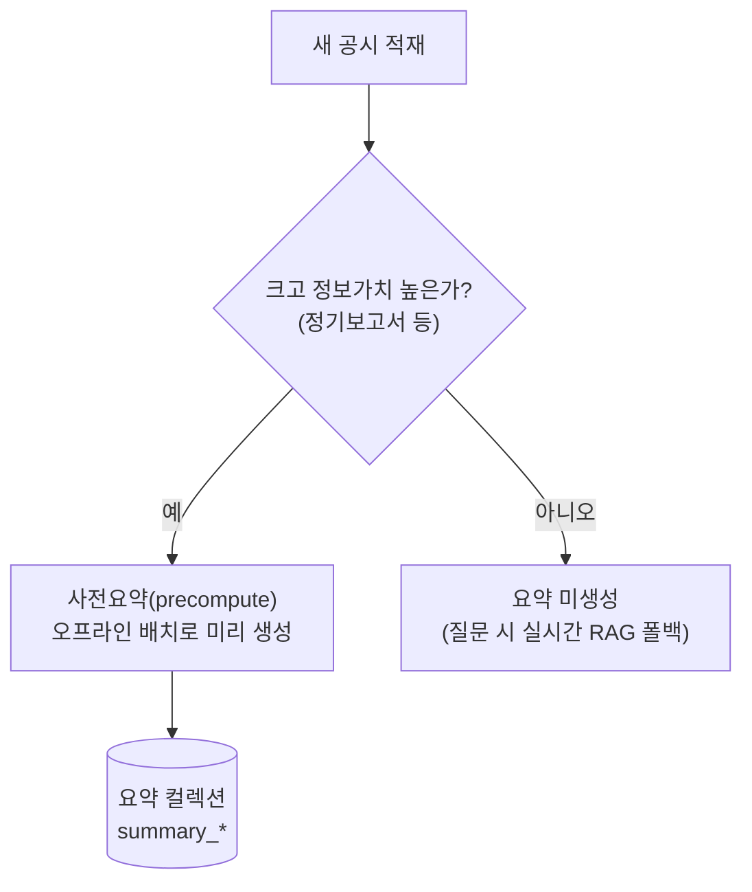
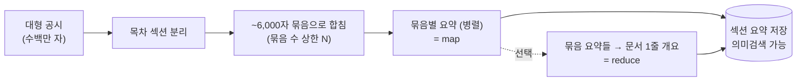
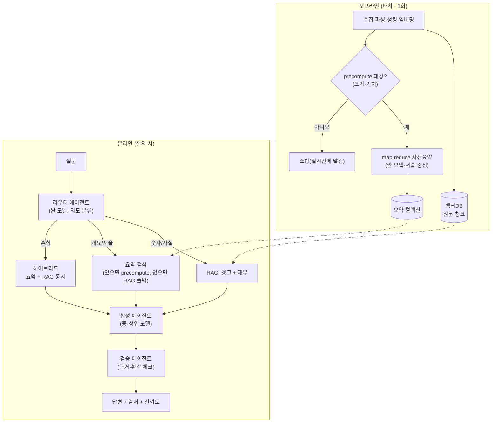

# AI/Agent 기반 공시요약 — 효율적 설계 (라우팅·사전요약·에이전트)

> 목적: 공시처럼 **크기 편차가 큰 문서**를 AI/Agent로 요약할 때, 무엇을 *미리(precompute)* 처리하고 무엇을 *실시간*으로 둘지, 그리고 라우팅·에이전트를 어떻게 구성해야 효율적인지 설계 가이드.
> 작성일: 2026-06-22 · 관련: [현업_공시분석_방법론.md](현업_공시분석_방법론.md) · [요약기능_변경_비교보고서.md](요약기능_변경_비교보고서.md)

---

## 1. 문제 — 공시는 크기 편차가 극심하다

| 공시 유형 | 대략 크기 | 실시간 요약하면? |
|---|---|---|
| 실적공시·IR·배당 등 단발성 | 수천 자 | 빠름(가능) |
| 감사보고서 | 수만 자 | 다소 느림 |
| **분기/반기보고서** | 수십만 자 | 느림·비쌈 |
| **사업보고서** | **수백만 자**(삼성 ~384만 자) | **불가**(요약에 수십 콜·수십 초~분) |

→ **대형 공시를 질문 때마다 실시간 요약하면**: ① 사용자가 수십 초~분 대기 ② 같은 문서를 물을 때마다 요약 비용 반복. **사용자 경험·비용 모두 불가.**

**그래서 핵심 원칙**: *느리고 큰 요약은 적재 시점에 미리 만들어 저장(precompute), 질문 땐 꺼내 쓰기만 한다.*

---

## 2. 핵심 결정 — 무엇을 precompute, 무엇을 실시간?

판단 기준(세 축):

| 축 | precompute 대상 | 실시간(폴백) |
|---|---|---|
| **크기** | 큼(실시간 요약 불가) | 작음(실시간도 빠름) |
| **정보가치** | 높음(사업·재무 풍부) | 낮음·단발성 |
| **재사용 빈도** | 자주 질문됨 | 드묾 |

> 본 프로젝트 적용: **정기보고서(사업·반기·분기·감사) 33건만 precompute**, 나머지 ~479건은 실시간 RAG 폴백. → "큰 건 미리, 작은 건 그때그때"를 정확히 구현.

---

## 3. 대형 문서를 precompute하는 방법 (map-reduce)

수백만 자를 한 번에 LLM에 못 넣으니, **목차 섹션을 묶음으로 나눠 묶음별 요약(map)** 하고, 선택적으로 **전체 개요(reduce)** 를 얹는다.

설계 포인트:
- **묶음 상한(max_sections)**: 호출 폭증 방지(예: 사업보고서 5,094 micro-섹션 → 20~40묶음). 낮출수록 싸지만 묶음이 거칠어짐.
- **병렬(map)**: 묶음 요약은 서로 독립 → 동시 실행으로 빌드 시간 ↓↓ (refine처럼 순차로 묶을 필요 없음).
- **계층(reduce/RAPTOR)**: 묶음 요약 위에 "문서 전체 개요"를 한 단계 더 올리면 "이 회사 한 줄 요약" 품질↑.
- **절단 주의**: 호출당 입력 상한이 있어 초대형 문서는 일부가 잘림 → *추출 프리필터링*(핵심 문장 선별)으로 보완.

---

## 4. 라우팅 · 에이전트 아키텍처 (오프라인 + 온라인)

에이전트 역할:
1. **라우터**: 질문을 분류(사실/서술/혼합/범위밖) → 트랙 선택. *가벼운 분류라 싼 모델.*
2. **검색**: 트랙별로 근거 수집(코드가 결정적으로) — 환각 줄이려 "검색은 코드, 생성은 근거 안에서만".
3. **합성**: 모은 근거로 답 생성.
4. **검증**: 근거 충실도·환각 판정(verdict/score) — auditable.

> 핵심: **"precompute 대상 결정"은 오프라인 라우팅, "트랙 선택"은 온라인 라우팅**. 둘 다 라우팅이지만 시점·기준이 다르다.

---

## 5. 모델 티어링 (효율의 절반은 여기서)

| 단계 | 난이도 | 권장 티어 | 근거 |
|---|---|---|---|
| 라우터(분류) | 쉬움 | 소형 | 분류는 소형으로 충분 |
| 사전요약(서술) | 쉬움 | 소형(gpt-4o-mini) | 숫자 책임 제거 → 검증됨 |
| 답변 합성 | 중간 | 중·상위 | 정확·일관 |
| 검증 | 어려움 | 추론형 | 환각 판정 |

---

## 6. 효율 레버 (비용·지연·품질)

| 레버 | 주는 이득 | 본 프로젝트 |
|---|---|---|
| precompute + 선택적 범위 | 비용·지연 ↓↓ | ✅ 적용(정기 33건) |
| 싼 모델 + 역할 분리(숫자=RAG) | 비용 ↓↓ | ✅ 적용(~98%↓) |
| map 병렬화 | 빌드 지연 ↓↓ | ⬜ 미적용(순차 51분 → 수 분) |
| 추출 프리필터링 | 입력토큰·환각 ↓ | ⬜ 미적용 |
| 시맨틱 캐싱 | 반복 질문 비용 ↓ | ⬜ 미적용 |
| 계층 요약(reduce/RAPTOR) | 전체 개요 품질 ↑ | ⬜ 미적용 |

---

## 7. 본 프로젝트 매핑 & 다음 단계

**이미 갖춘 것**: 오프라인 precompute(정기보고서, map 방식) + 온라인 라우팅(사실/서술) + 모델 티어링 + 검증. → 위 설계의 1·2·5·일부6층.

**효율을 더 올릴 다음 3가지(우선순위)**
1. **하이브리드 트랙(ⓑ)** — 혼합 질문(서술+숫자)이 지금 숫자만 답함 → 요약 트랙이 RAG도 끌어오게. *(체감 최대)*
2. **map 병렬화** — 사전요약 빌드 동시 호출(51분 → 수 분).
3. **묶음 제목 개선 + (선택)reduce** — 깨진 대표제목 → LLM이 묶음 주제 한 줄 부여, 문서 1줄 개요 추가 → 검색·개요 품질↑.

---

## 8. 한 줄 요약

> **느리고 큰 요약(대형 공시)은 오프라인에서 미리 map-reduce로 만들어 저장하고, 질문 때는 라우터가 "사실→RAG / 서술→사전요약 / 혼합→둘 다"로 보내며, 각 단계는 난이도에 맞는 모델 티어를 쓰고, 마지막에 근거를 검증한다** — 이것이 비용·지연·품질을 동시에 잡는 구성이다.
