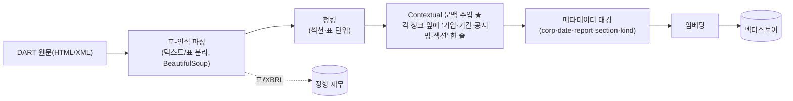
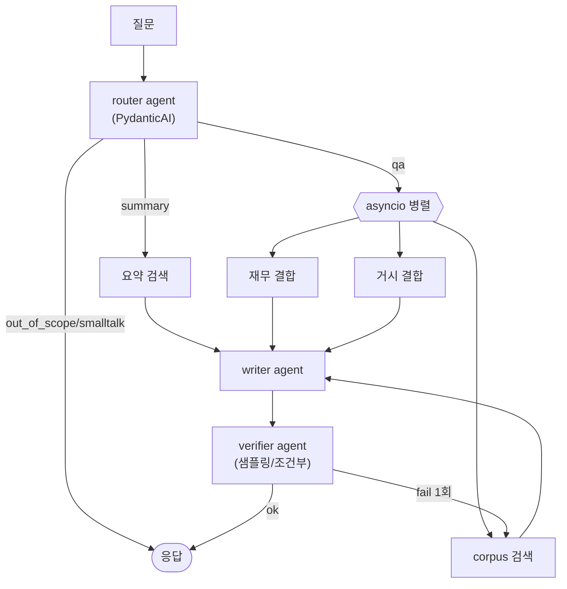

# gongsi-agent → PydanticAI 재구축 — 종합 보고서

> 목적: 현재 공시분석 에이전트를 **PydanticAI 기반 + production 파이프라인(표파싱·Contextual·하이브리드)** 으로 재구축하기 위한 설계·근거·개발계획을 하나로 정리한다.
> 작성일: 2026-06-22 · 맥락: 과제 평가·포트폴리오 시연용
> 관련: [공시분석_production_아키텍처.md](공시분석_production_아키텍처.md) · [production전환_개발계획.md](production전환_개발계획.md) · [에이전트_프레임워크_입문.html](에이전트_프레임워크_입문.html)

---

## 0. TL;DR
- **챗봇은 유지하되 RFP의 "요약·근거응답·보관·조회 과제형"을 1급 축으로** 둔다(이미 `/analyze`·`/api/analyses` 존재).
- **PydanticAI 채택** — 코드가 이미 Pydantic-native라 현 CrewAI 단일-래퍼를 **가장 적은 변경 + 경량 + 타입세이프**로 대체.
- **"기존 함수 1:1 교환"은 PydanticAI 철학에 어긋나지 않는다.** 단 "매 호출 재생성" 같은 안티패턴은 버리고 **모듈-레벨 에이전트 + deps 주입 + retrieve-then-read** 관용구로.
- **인제스트 재설계가 핵심**: 표-인식 파싱 → 청킹 → **Contextual 문맥 주입(필수)** → 메타 태깅 → 임베딩.
- **새 디렉토리(`gongsi-agent-v2`)에서 클린 재구축** 권장(기존 보존). 재적재 예정이라 데이터 복사 불필요.

---

## 1. 챗봇 형태가 맞나? (RFP 정합)
RFP는 명시한다: *"단순 RAG 챗봇에 그치지 말고 **요약·근거응답·보관·조회**를 묶은 과제형 시스템."*
- **챗봇 자체는 문제없음** — 다만 그게 *전부*면 RFP 미달. 핵심은 **과제형(보관·조회)**.
- 현재 구현: `/analyze`(공시 1건 요약+근거 QA+SQLite 영속) + `/api/analyses`(목록)·`/api/analyses/{id}`(상세) = **과제형 충족**. `/api/v1/chat`(멀티턴·멀티공시)은 우대 확장.
- **결론**: 챗봇 UX는 유지하되, **"요약→근거 QA→보관→조회" 흐름을 제품의 1급 축**으로 유지·강조한다. (재구축 시에도 이 흐름을 먼저 보장)

---

## 2. PydanticAI란 / 왜 / 간단 비교
**PydanticAI** = Pydantic 팀의 타입세이프 에이전트 프레임워크(V1, 2025-09).
- **구조화 출력 1급**: `Agent(output_type=PydanticModel)` → 결과를 Pydantic으로 검증 + **실패 시 자동 재시도**.
- **deps(의존성 주입)**: 벡터스토어·설정 등을 타입 안전하게 주입.
- **tools / 멀티에이전트**: 위임·핸드오프·`pydantic-graph`. **Logfire** 관찰성.

**왜 우리 프로젝트에 (요지)**: 코드가 이미 Pydantic 결과(RouterResult/QAResult/…)를 쓰고, 현 CrewAI는 그걸 뽑는 무거운 단일-래퍼라 → **그 자리에 더 가볍고 타입세이프한 PydanticAI**가 최소 변경으로 들어맞음.

| 프레임워크 | 한 줄 | 우리 적합도 |
|---|---|---|
| LangChain | 부품 상자(통합·RAG) | 부품엔 좋으나 무거움 |
| LangGraph | 순서도를 코드로(흐름) | 흐름 복잡하면 ◎, 우리 규모엔 다소 과함·인지도 최고 |
| **PydanticAI** | 타입세이프 에이전트(구조화 출력) | **◎ Pydantic-native·경량·최소코드** |
| CrewAI(현재) | 역할극 팀 | 단일 래퍼로 전락 → 가치 0 |

(자세한 입문은 `에이전트_프레임워크_입문.html`)

---

## 3. "기존 함수 1:1 교환"이 PydanticAI 철학에 어긋나나? (핵심)
**결론: 어긋나지 않는다.** 다만 *단순 복제*가 아니라 *관용구화*가 필요하다.

- **왜 OK**: 툴 없이 `output_type`만 쓰는 **구조화-출력 전용 에이전트**는 PydanticAI의 1급 사용법. 검색을 코드가 끝내고 근거를 프롬프트로 넣는 **retrieve-then-read**도 (환각·비용·결정성 측면에서) 권장되는 패턴.
- **단, 현 CrewAI의 안티패턴은 버린다**:

| 현재 (CrewAI) | 재구축 (PydanticAI 관용구) |
|---|---|
| 매 호출마다 Agent+Task+Crew **재생성** | **모듈 레벨에서 1회 정의·재사용** |
| `output_pydantic`로 결과 | `output_type=기존 Pydantic 모델` (검증+재시도) |
| 검색 결과를 프롬프트 문자열로 끼움 | **deps 주입** + retrieve-then-read(또는 일부 tool화) |
| system 지시 산재 | 에이전트 정의에 **system prompt 고정** |

```python
# 관용구 예시 — 모듈 레벨 1회 정의, 재사용
from pydantic_ai import Agent, RunContext
from app.schemas import QAResult, Deps

qa_agent = Agent(
    "openai:gpt-5.1",
    deps_type=Deps,                 # 벡터스토어·설정 주입
    output_type=QAResult,           # 기존 Pydantic 모델 그대로
    system_prompt="공시 근거 안에서만 답하고 출처를 단다 ...",
)

async def run_qa(question: str, citations: list, deps: Deps) -> QAResult:
    # retrieve-then-read: 검색은 코드가 끝내고 근거를 넣는다
    return (await qa_agent.run(_prompt(question, citations), deps=deps)).output
```
→ **매핑**: `run_router/run_summary/run_chat_qa/run_verification/run_title/summarize_text` → 각각 모듈-레벨 PydanticAI Agent. **1:1 + 관용구화**.

---

## 4. Production 파이프라인 (재구축 타깃)
`공시분석_production_아키텍처.md`를 흡수해, 인제스트와 런타임 둘로 본다.

### 4-1. 인제스트 재설계 — 청킹 재작업 + Contextual (★핵심)

- **Contextual 문맥 주입이 검색 정확도의 핵심**: 고아 청크("매출 3% 증가")에 "[삼성전자 2024 사업보고서 매출]" 문맥을 붙여 임베딩 → 검색이 잘 맞음(Anthropic Contextual Retrieval, 실패율 대폭↓).
- 표는 **표-인식**으로 구조 보존(현재 plaintext 뭉갬 문제 해결) → 키워드스캔·휴리스틱 리랭커 군더더기 제거.
- 비용 변수 = Contextual 적용 범위(정기보고서 corpus 우선 권장).

### 4-2. 런타임 — PydanticAI 에이전트 + 오케스트레이션

### 4-2-1. 노드(에이전트/단계) 하나하나
> 용어: **qa = 질의응답 트랙**(특정 사실·수치를 묻는 질문). **summary = 요약 트랙**(개요·사업 내용 등 서술). Router가 둘 중 하나로 보냄.

| 노드 | 종류 | 역할 | 입력 → 출력 |
|---|---|---|---|
| **router** | LLM 에이전트 | 질문을 분류: intent(summary/qa/smalltalk/out_of_scope) + **관련성 플래그**(`financial_relevant`·`macro_relevant`) + 검색쿼리·기간 | 질문 → `RouterResult` |
| **요약 검색** | 검색(코드) | `summary_<corp>` 컬렉션에서 사전요약 조각을 의미검색 | 쿼리 → 요약 근거들 |
| **corpus 검색** | 검색(코드) | **해당 기업의 공시 원문 청크 컬렉션(`corpus_<corp>`)** 에서 근거 검색(하이브리드: 벡터+BM25) | 쿼리 → 원문 근거들 |
| **재무 결합** | 데이터(코드) | DART 정형 재무(매출·영업이익 등)를 근거로 추가 | corp → 재무 인용 |
| **거시 결합** | 데이터(코드) | ECOS 거시(환율·금리 등)를 같은 시점 근거로 추가 | 날짜 → 거시 스냅샷 |
| **writer** | LLM 에이전트 | 모은 근거 **안에서만** 답을 작성(+출처) | 근거들 → `QAResult`/요약 |
| **verifier** | LLM 에이전트 | 답이 근거에 충실한지 채점(verdict·groundedScore) | 답+근거 → `VerificationResult` |

- **"corpus 검색"이 뭔가**: 회사별로 공시 원문을 잘게 쪼개 임베딩해둔 벡터 컬렉션(`corpus_삼성코드`)에서, 질문과 의미가 가까운 청크를 찾아오는 단계. (요약 검색은 *사전요약* 컬렉션, corpus 검색은 *원문 청크* 컬렉션 — 둘은 다른 저장소)
- **"corpus가 그 Contextual인가?"**: corpus = 원문 청크 *저장소*. Contextual = 그 청크들을 임베딩할 때 문맥을 붙이는 *기법*(주로 corpus에 적용). → **corpus 검색이 Contextual 덕을 보는** 관계.
- **"요약 검색은 LLM인가?"**: 아니다. 요약 검색 = *임베딩 벡터 검색*(LLM 아님). 헷갈리기 쉬운 3가지를 구분:
  - ① 사전요약을 **만든** 모델(빌드 타임) ② 검색에 쓰는 **임베딩** 모델 ③ 답을 **쓰는** writer 모델 — 셋이 다르다.

### 4-2-1b. 각 노드의 모델/엔진 (기존 → 추천)
| 노드 | 기존 | 추천 | 이유 |
|---|---|---|---|
| **router** | gpt-5.1 | **gpt-4o-mini**(싼 모델) | 분류는 쉬운 작업 |
| 요약 검색 | 임베딩 text-embedding-3-small | 동일 | 검색(LLM 아님) |
| **사전요약 생성**(빌드) | gpt-5.1(기본) | **gpt-4o-mini**(실측 검증) | 서술 요약은 싼 모델로 충분 |
| corpus 검색 | 임베딩 + 키워드스캔 | **임베딩 + BM25 하이브리드 + 리랭킹** | 정확매칭·랭킹↑ |
| **writer**(답 작성) | gpt-5.1(qa_model) | **gpt-5.1 유지** | 답 품질이 핵심 |
| **verifier**(검증) | o4-mini(추론형) | **o4-mini 유지 + 샘플링** | 근거 채점엔 추론형, 단 매턴→일부만 |
> 모델 티어링 원칙: 쉬운 일(분류·요약)=싼 모델, 어려운 일(답·검증)=상위/추론형. 모델명은 .env로 조정.

### 4-2-2. "asyncio 병렬"이 뭔가
- corpus 검색·재무 결합·거시 결합은 **서로 독립**(서로의 결과가 필요 없음). 순서대로 하면 (검색 2초)+(재무 1초)+(거시 1초)=4초.
- **asyncio 병렬 = 셋을 동시에 실행**해 가장 느린 하나(2초)만 기다림 → 지연↓. 파이썬 `await asyncio.gather(corpus(), financial(), macro())` 한 줄.
- 부가효과: 하나가 실패해도 **나머지는 살림**(부분실패 graceful) → RFP #5.

### 4-2-3. Contextual은 "어디서" 쓰이나
- 인제스트(4-1)에서 청크에 박아둔 문맥은 **검색 시점(corpus 검색 노드)** 에서 빛난다. 문맥이 임베딩에 녹아 있어, "삼성 2024 매출" 질문이 "[삼성전자 2024 사업보고서 매출] 매출 3% 증가" 청크를 **정확히 매칭**. → corpus 검색 품질↑ = 최종 답 근거 품질↑.
- 즉 Contextual은 *인제스트에서 만들고 → corpus 검색에서 소비*한다.

### 4-2-4. 요약 + 재무·거시가 섞이면 라우팅은?
- Router가 **intent 1개**(summary/qa)를 정하고, 동시에 **플래그**(`financial_relevant`·`macro_relevant`)를 켠다.
- **qa intent + 재무/거시 플래그** → qa 트랙에서 corpus 검색에 **재무·거시 근거를 병렬로 합쳐** writer가 통합 답. (예: "매출 얼마고 환율 영향은?" → corpus+재무+거시)
- **summary intent** → 요약 검색 위주. *여기에 정밀 수치가 필요하면* 현재 설계는 약함 → **하이브리드 트랙(요약 검색 + corpus/재무 일부 결합)** 으로 보강 가능(개선 항목). 즉 "요약+숫자" 혼합은 라우팅을 qa로 보내거나 하이브리드 트랙으로 처리.
- **하이브리드 트랙은 오래 걸리나?** 거의 아니다. 추가되는 건 *검색 한두 번 더*(요약+corpus/재무)인데 검색은 빠르고(수백 ms~1초) **병렬 실행** 가능. 시간을 좌우하는 건 LLM 호출(writer+verifier)인데 그 횟수는 동일 → **체감 지연 거의 그대로**(+검색 0.5~1초 수준).

### 4-2-6. OpenAI API는 어디서·얼마나 쓰이나 (시연과 별개)
대부분의 OpenAI 비용은 **인제스트(빌드 타임, 1회성)** 에 몰린다. 런타임(질문당)은 적다.
| 시점 | 용도 | 모델 | 비용 |
|---|---|---|---|
| **인제스트(1회)** | 청크 임베딩 | text-embedding-3-small | 137k청크 ~$1.4 |
| **인제스트(1회)** | Contextual 문맥 생성 | gpt-4o-mini | 청크당 1콜 → 선택적 ~$3 / 전면 ~$20+ |
| **인제스트(1회)** | 사전요약 생성 | gpt-4o-mini | 정기 33건 ~$1-2 |
| 런타임(질문당) | router | gpt-4o-mini | 1콜(싸다) |
| 런타임(질문당) | 쿼리 임베딩 | text-embedding-3-small | 1콜(미미) |
| 런타임(질문당) | writer | gpt-5.1 | 1콜 |
| 런타임(질문당) | verifier | o4-mini | 샘플링(예: 20%만) |
| 데이터(DART·ECOS) | 공시·거시 | — | **OpenAI 아님(무료 API)** |
- **질문 1건 ≈ ~$0.02–0.05.** 골든셋/시연 1회 ≈ ~$0.6.
- 즉 "큰 돈은 인제스트에서 1회, 이후 질의는 푼돈." Contextual 적용 범위가 인제스트 비용의 최대 변수.

### 4-2-5. 이게 "일반적인 PydanticAI 파이프라인"인가? + 현재와 무엇이 다른가
- PydanticAI는 *파이프라인을 정해주지 않는다.* 기본 단위는 **에이전트 1개(+output_type/tools/deps)**. 위처럼 여러 단계를 잇는 건 **우리 오케스트레이션 설계**(PydanticAI의 "프로그램적 핸드오프" 패턴)이며 일반적인 RAG+에이전트 구성이다. (더 복잡해지면 `pydantic-graph`)
- **흐름은 현재와 비슷하다 — 의도적**이다. 현 로직(router→검색→writer→verify→CRAG)은 합리적이라 유지. **바뀌는 핵심은 "구현·품질"**:

| 구분 | 현재 | 재구축 |
|---|---|---|
| 에이전트 프레임워크 | CrewAI(매 호출 재생성·툴 dead) | **PydanticAI**(모듈레벨·타입세이프·검증) |
| 파싱 | 표를 plaintext로 뭉갬 | **표-인식** |
| 청킹 | 단순 섹션 | **+Contextual 문맥 주입** |
| 검색 | 벡터+키워드스캔 우회 | **벡터+BM25 하이브리드+리랭킹** |
| 검증 | 매 턴(비쌈) | **샘플링/조건부** |
| 병렬 | 사실상 순차 | **asyncio 병렬** |
- 즉 다이어그램의 "그림"은 닮았지만, **각 노드의 속(파싱·검색·프레임워크·비용)이 production급으로 바뀐다.**

### 4-3. 과제형(RFP 필수) 유지
요약·근거 QA·**보관(DB)**·**조회(목록/상세)** 를 1급으로 유지. (기존 `storage` + analyses 엔드포인트 포팅)

---

## 5. 새 디렉토리에서 재구축 (권장: 예)
- **권장: 새 레포/디렉토리 `gongsi-agent-v2`에서 클린 재구축.** 기존은 보존(레퍼런스·롤백·안전한 시연).
- **데이터**: Contextual+새 청킹으로 **전면 재적재 예정 → 기존 Chroma 복사 불필요.** `.env`·`corpcode.json` 캐시·인제스트 스크립트만 재사용, 공시 원문은 무료 재취득(같은 회사: 삼성·현대).
- **이점**: 프레임워크 swap+재적재 대수술을 안정 버전과 분리. 포트폴리오상 "v2 클린 설계" 서사.

### 제안 디렉토리 구조
```
gongsi-agent-v2/
  app/
    ingest/      # 표파싱·청킹·contextual·임베딩(인제스트 파이프라인)
    rag/         # 벡터+BM25 하이브리드·리랭킹
    agents/      # PydanticAI Agent 정의(router/summary/qa/verifier ...)
    services/    # 오케스트레이션(핸드오프+asyncio)·persist
    api/ storage/ schemas/
  eval/          # 골든셋(기존 포팅)
  tests/ Dockerfile README(설계서)
```

---

## 6. 단계별 로드맵 + 시간/비용
| 단계 | 내용 | 앱 OpenAI 소모(추정) |
|---|---|---|
| 0. 인제스트 | 표파싱+청킹+**Contextual**+메타+임베딩 (정기보고서 우선) | Contextual: 선택적 ~$3 / 전면 ~$20+, 재임베딩 ~$1.4 |
| 1. 에이전트층 | crew 7함수 → PydanticAI Agent(모듈레벨·deps·output_type) | 골든 ~$2-3 |
| 2. 오케스트레이션 | 핸드오프+asyncio+graceful (+필요시 pydantic-graph) | 골든 ~$2-3 |
| 3. 과제형·운영 | 보관/조회 포팅, Logfire 로깅, 테스트, Docker | 미미 |
| **합계** | **코드작업 며칠 + 앱 OpenAI ~$10~$35** | (Contextual 범위가 변수) |
- 앱 OpenAI 소모는 프레임워크 무관. PydanticAI는 CrewAI 대비 코드·의존성 경량.

---

## 7. 검증 / RFP 시연
- **RFP 필수 시연**: 공시 입력 → 요약 → 근거 QA(출처 표시) → 보관 → 목록/상세 조회.
- **회귀**: 기존 `eval/run_chat_golden.py`·`run_golden.py` 포팅 후 단계별 실행.
- **before/after**: 표 질문 정확도(표파싱), 검색 정확도(Contextual+하이브리드), 턴당 비용·지연(CrewAI 제거·검증 샘플링).

---

## 8. 출처
- PydanticAI: [공식 문서](https://ai.pydantic.dev/), [Multi-Agent 패턴](https://pydantic.dev/docs/ai/guides/multi-agent-applications/), [vs LangGraph(ZenML)](https://www.zenml.io/blog/pydantic-ai-vs-langgraph)
- Contextual Retrieval: [Anthropic](https://www.anthropic.com/news/contextual-retrieval)
- 표/XBRL·금융 RAG: [Daloopa](https://daloopa.com/blog/analyst-best-practices/rag-systems-for-financial-tables-enhancing-excel-data-with-ai-context), [FinSage(arXiv 2504.14493)](https://arxiv.org/pdf/2504.14493)
- 내부 문서: `공시분석_production_아키텍처.md`, `production전환_개발계획.md`, `에이전트_프레임워크_입문.html`
