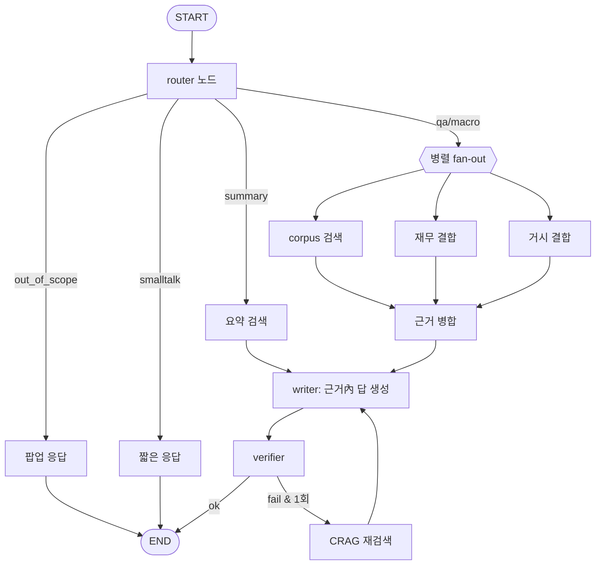

# gongsi-agent를 production 느낌으로 — 전환 개발계획

> 목적: 현재 구조의 "실무와 거리 + 과(過)설계" 지점을 진단하고, RFP에 정합하면서 ①경량화 ③분석역량 ④진짜 멀티에이전트를 조화하는 **LangGraph 기반 전환 계획**을 제시한다.
> 작성일: 2026-06-22 · 맥락: 과제 평가·포트폴리오 시연용 · 관련: [현업대비_개선전략.md](현업대비_개선전략.md) · [공시분석_production_아키텍처.md](공시분석_production_아키텍처.md)

---

## 0. TL;DR
- **채택 = 대안 B(LangGraph 백본) + 표파싱·하이브리드 검색 + 린 정리.** CrewAI는 "진짜 협업이 값있는 한 곳"에만 선택적.
- **기존 데이터(삼성·현대 청크·사전요약·SQLite)는 거의 전부 재사용** — LangGraph는 흐름만 재배선. 재적재는 표파싱/Contextual 같은 역량 업글 때만.
- **시작 권장 = 0단계(표-인식 파싱)** — ROI 최고(하류 군더더기 동시 제거).
- 자동화 시: 코드작업 며칠 분량 + 앱 OpenAI 소모 ~$10~$35(Contextual 범위가 변수).

---

## 1. 현황 진단 — 왜 전환하나
RAG·인용·eval 알맹이는 좋다. 다만 다음이 "실무와 거리"를 만든다:
| 과(過)설계 지점 | 문제 |
|---|---|
| **CrewAI = 단일 에이전트 래퍼** | `crew.py` 7개 함수가 매번 단일-agent·단일-task crew 생성 → 오케스트레이션 가치 0. 툴(`tools.py`)은 import 안 됨(dead code) |
| **매 턴 이중 LLM 검증** | router+qa+verification = 턴당 3콜(+CRAG 시 5). 비용·지연 주범 |
| **270줄 휴리스틱 리랭커** | `rerank.py` 하드코딩 한국어 표현·가중식 → 과적합·유지비 |
| **표 파싱 부재** | `dart._strip_dart_xml`가 표를 plaintext로 뭉갬 → 키워드스캔·재무API 우회 복잡도 유발(근본원인) |
| **운영 공백** | 테스트·Docker·로깅·예외핸들러 없음, `.env` 커밋, 거의 전부 sync-blocking |

---

## 2. 전환 대안 3종

### A. "CrewAI를 제대로" (프레임워크 유지)
단일 래퍼들을 **하나의 진짜 Crew**로(역할 에이전트 협업+툴 부활+async+부분실패 graceful). 검증 샘플링.
- 장점: repo 프레임워크 유지로 RFP #5 충족. 단점: 조건부 분기·부분실패 제어 약함, 과거 툴콜 버그.

### B. "LangGraph 오케스트레이션" ⭐권장
`handle_turn`+얇은 CrewAI를 **상태그래프**로(router→병렬 검색/재무/거시→writer→verifier, 실패격리·조건부 CRAG). 표파싱·하이브리드를 그래프 툴로. CrewAI는 협업 1곳만 선택적.
- 장점: 포트폴리오 신호 최고(현대적·제어·관찰·실패격리), RFP 정합, 경량+테스트 용이. 단점: 마이그레이션 공수, 신규 의존성.

### C. "린+선택" (최소)
단순 호출 CrewAI 제거(직접 structured 호출), 멀티에이전트는 명목상(역할분리 함수). 가장 단순·저비용. 단점: 포트폴리오 임팩트 약함.

| | A | **B ⭐** | C |
|---|---|---|---|
| RFP #5 멀티에이전트 | ○ | ◎ | △ |
| 경량/비용 | △ | ○ | ◎ |
| 부분실패 제어 | △ | ◎ | ○ |
| 포트폴리오 임팩트 | ○ | ◎ | △ |
| 공수 | 中 | 中~大 | 小 |

---

## 3. 기존 데이터 재활용 (거의 전부 재사용)
| 자산 | B(LangGraph)만 | 표파싱/Contextual 적용 시 |
|---|---|---|
| corpus 청크(삼성 6.0만·현대 7.7만) | ✅ 그대로 | 재적재(같은 회사·무료 원문 재처리) |
| 사전요약 486개(`summary_*`) | ✅ 그대로 | 표/청킹 바뀌면 재빌드(~$1-2) |
| SQLite(analyses·chat_turns·macro_cache) | ✅ 그대로 | ✅ 그대로 |
- LangGraph는 **흐름만 재배선** → 데이터·검색 함수 그대로 호출. 임베딩 provider 유지 시 벡터 유효, 청킹/Contextual 변경 때만 재임베딩(~$1.4, 저렴).

---

## 4. LangGraph 입문 (핵심만)
- **개념**: 상태(State)를 들고 **노드(함수/LLM/툴)** 를 **엣지**로 잇는 그래프 = "순서도를 코드로".
- **상태**: 질문·검색결과·답·에러 등 누적 dict를 노드가 읽고 갱신.
- **강점(우리에게 왜)**:
  1. **조건부 분기** — intent 라우팅·CRAG 재시도
  2. **병렬 노드** — corpus검색+재무+거시 동시
  3. **부분실패 격리** — 한 노드 실패해도 계속(= RFP #5 "무중단")
  4. **관찰성** — 노드별 입출력 추적(LangSmith)
- **현재 코드 매핑**: `handle_turn`의 if/else=조건부 엣지, `_gather` 순차검색=병렬 노드, try/except 격리=노드 에러 상태.
- **CrewAI와 차이**: CrewAI=에이전트 협업/위임(블랙박스 성향), LangGraph=흐름 제어/관찰(결정적 파이프라인에 적합).

---

## 5. 타깃 파이프라인 (그래프)

- 각 노드=집중 1스텝(직접 structured LLM 호출 또는 검색/툴). 실패 노드는 상태에 에러 적고 계속.
- (선택) "다관점 요약 협업"이 필요하면 그 노드 내부에만 **CrewAI sub-crew** → "왜 LangGraph/왜 CrewAI" 설명 포인트.

---

## 6. 단계별 개발 계획 (어디서부터)
| 단계 | 내용 | 핵심 파일 | 재적재 |
|---|---|---|---|
| **0. 근본원인·정리** | 표-인식 파싱(BeautifulSoup, 이미 의존성) → 키워드스캔·휴리스틱 리랭커 군더더기 제거. 검증 매턴→샘플링. dead code 정리 | `data/dart.py`, `rag/rerank.py`, `services/chat.py` | 요약 재빌드(선택) |
| **1. 검색 품질** | BM25 하이브리드+리랭킹, 청킹 메타 강화+경량 Contextual(공시명·섹션 prepend) | `rag/vectorstore.py`, `rag/chunker.py` | 코퍼스 재적재(역량) |
| **2. 오케스트레이션** | `handle_turn`+`pipeline.analyze`(중복)→단일 **LangGraph** 그래프. 얇은 CrewAI는 노드 직접호출로. (선택) 협업 sub-crew 1곳 | 신규 `app/graph/`, `services/chat.py`, `agents/crew.py` | 없음 |
| **3. 운영 성숙도** | pytest(+eval 회귀), Dockerfile, 구조화 로깅, 예외 핸들러, `.env` 정리, 핵심 경로 async | `main.py`, 신규 `tests/`·`Dockerfile`·`.github/` | 없음 |

> 시작 권장 = **0단계(표파싱)**: ROI 최고(하류 군더더기 동시 제거), 재적재 최소. 각 단계 독립적이라 중간에 멈춰도 산출 남음.

---

## 7. 시간·API 비용 추정 (자동화 진행 시)
구분: **(가) 코드작업**(Claude 세션, OpenAI 무관) vs **(나) 앱 OpenAI 소모**(테스트·재적재).

| 단계 | 코드작업 분량 | 앱 OpenAI 소모(추정) |
|---|---|---|
| 0 표파싱·정리 | 반나절 상당 | 골든 ~$2 + 요약 재빌드 ~$1-2 |
| 1 하이브리드+Contextual | 하루 상당 | 재임베딩 ~$1.4 + **Contextual: 선택적 ~$3 / 전면 ~$20+** |
| 2 LangGraph | 하루 상당 | 골든 ~$2-3 |
| 3 운영 | 반나절 상당 | 미미 |
| **합계** | **며칠(확인·검증 텀 포함)** | **~$10(선택적)~$35(전면 Contextual)** |
- 비용 핵심 변수 = **Contextual 적용 범위**(전 청크면 비쌈 → 정기보고서 corpus만 선택 권장). 추정치 ±, 단계별 골든셋 검증하며 진행.

---

## 8. 검증
- **RFP 필수 시연**: 공시 입력→요약→근거 QA(출처)→보관→목록/상세 조회 동작.
- **회귀**: `eval/run_chat_golden.py`(must 12/12) + `eval/run_golden.py`, 각 단계 후.
- **before/after 지표**: 턴당 LLM 호출·지연·비용(검증 샘플링·CrewAI 제거), 표 질문 정확도(표파싱), 복합/혼합 질문(그래프).
- **설계 설명서(RFP 산출물)**: 본 계획 + 기존 docs(현업 방법론·production 아키텍처·개선전략)로 근거 제시.
