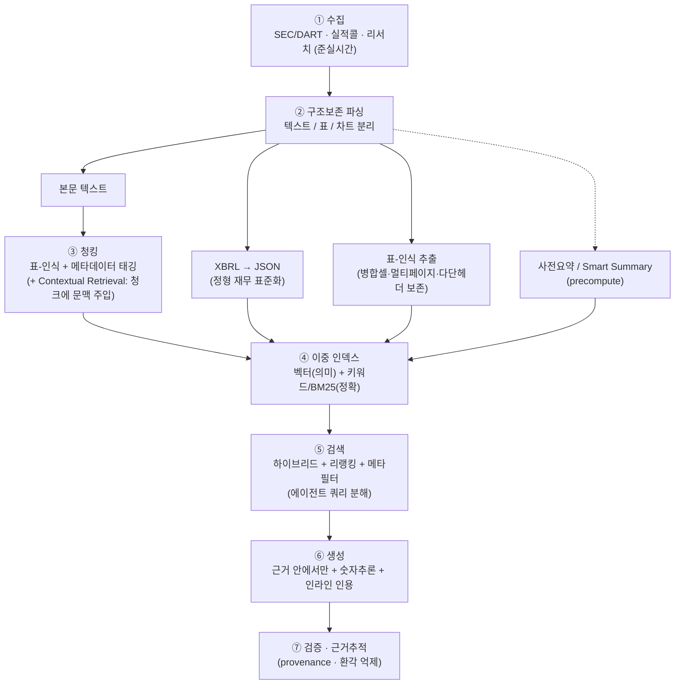

# 현업 공시분석 시스템은 실제로 어떻게 구성되나 (Production 아키텍처)

> 목적: AlphaSense·Hebbia 등 실무 공시/문서 분석 제품과 금융 RAG 연구가 **데이터 청킹·파싱부터 전체 파이프라인**을 어떻게 구성하는지 정리하고, 본 프로젝트와 비교한다.
> 작성일: 2026-06-22 · 관련: [현업_공시분석_방법론.md](현업_공시분석_방법론.md) · [AI공시요약_효율설계.md](AI공시요약_효율설계.md)

---

## 0. 한 줄 요약

> 현업 공시분석은 *"그냥 텍스트 청킹 + 벡터검색"이 아니다.* **①구조보존 파싱(특히 표·XBRL) → ②표-인식·문맥주입 청킹 → ③하이브리드 인덱스(의미+키워드) → ④에이전트 검색+리랭킹 → ⑤근거 안에서만 생성+인용+검증** 으로 돌아간다. 표/숫자/구조를 살리는 파싱과 하이브리드 검색이 진짜 차별점이다.

---

## 1. 두 가지 대표 설계 철학

| | **AlphaSense** — 정확성-우선 RAG | **Hebbia (Matrix)** — 에이전트 분해 |
|---|---|---|
| 코어 | 거대 큐레이션 코퍼스(500M+ 문서) + 하이브리드 검색 + 근거 인용 | 질문을 잘게 분해해 멀티 에이전트가 단계별 처리 |
| 검색 | 의미(임베딩) + 키워드(Boolean) 하이브리드, 도메인 모델 | "전체 문서를 통째로" + 수천 문서 동시 검색 |
| 도메인 모델 | 감성(10년 라벨링 실적콜), 회사/토픽 택소노미(엔티티 태깅) | 비전+텍스트 모델 동적 라우팅(멀티모달) |
| 산출 | Generative Search / Generative Grid, 인라인 인용, 환각 억제 | 그리드 UI(행=문서, 열=질문, 셀=에이전트 출력) |
| 에이전트 | 리서치 에이전트(2025~) | Orchestrator·Planning·Retrieval·Document analysis |

→ 한쪽은 **"잘 검색해 근거로 답"**, 다른 쪽은 **"질문을 분해해 에이전트가 단계별로"**. 실무는 둘을 섞는 추세(검색 품질 + 에이전트 오케스트레이션).

출처: [AlphaSense 작동방식(IntuitionLabs)](https://intuitionlabs.ai/articles/alphasense-platform-review), [Hebbia Matrix 소개](https://www.hebbia.com/blog/introducing-matrix-the-interface-to-agi), [Hebbia 멀티에이전트 재설계](https://www.hebbia.com/blog/divide-and-conquer-hebbias-multi-agent-redesign), [Hebbia × OpenAI](https://openai.com/index/hebbia/)

---

## 2. 공통 Production 파이프라인 (청킹·파싱부터)

### 단계별 핵심
1. **수집(Ingestion)**: 공시·전사록·리서치를 대규모·준실시간으로 인덱싱(AlphaSense는 연 수백만 문서, 500M+ 코퍼스).
2. **파싱(Parsing) — 공시에서 가장 어려운 단계**: 텍스트/표/차트를 **구조 보존**하며 분리. 딥러닝 기반 파서로 표·차트까지 추출. *일반 문서 RAG와 결정적 차이.*
3. **청킹(Chunking)**: 단순 글자수 분할이 아니라 **표-인식 청킹 + 메타데이터(회사·기간·섹션·공시유형) 태깅**. 흔히 **Contextual Retrieval**(임베딩 전 각 청크에 "이건 ACME Q2 공시의 매출 부분" 같은 문맥을 prepend)로 검색 정밀도 +5~15%p.
4. **이중 인덱스**: **의미 검색(임베딩)** + **키워드/BM25(티커·정확 수치)** 하이브리드. 정형(XBRL)·표는 정확매칭 경로로.
5. **검색(Retrieval)**: 하이브리드 → **리랭킹**, 메타필터. 복잡 질문은 **에이전트가 분해**(plan→retrieve→analyze)해 다단계로.
6. **생성(Generation)**: **검색된 근거 안에서만** 답(accuracy-first), **표/숫자 추론**, **인라인 인용**.
7. **검증(Verification)**: 출처로 되짚기(auditable provenance), 환각 억제 — 금융권 필수.

출처: [AlphaSense(IntuitionLabs)](https://intuitionlabs.ai/articles/alphasense-platform-review), [Anthropic Contextual Retrieval](https://www.anthropic.com/news/contextual-retrieval), [Document Parsing for Production RAG(Medium)](https://medium.com/@manikandan_t/document-parsing-for-production-rag-architecture-tradeoffs-and-when-to-use-what-7a89ab0af7b7)

---

## 3. 공시 특유의 난제 (왜 청킹·파싱이 특별한가)

| 난제 | 실무 대응 | 출처 |
|---|---|---|
| 표가 페이지를 넘어가고, 병합셀·다단 헤더·계산 종속성 | **표-인식 청킹**, 구조 보존 파싱, 의미+정확매칭 동시 | [Daloopa — 재무 표 RAG](https://daloopa.com/blog/analyst-best-practices/rag-systems-for-financial-tables-enhancing-excel-data-with-ai-context), [Captide](https://www.captide.ai/insights/how-to-turn-financial-reports-into-machine-readable-documents-for-rag) |
| 정형 재무(XBRL) vs 비정형 텍스트 혼재 | XBRL을 JSON으로 표준화 + 텍스트는 RAG | [edgartools ParsingXBRL](https://github.com/dgunning/edgartools/wiki/ParsingXBRL), [sec-api XBRL 추출](https://sec-api.io/resources/extract-financial-statements-from-sec-filings-and-xbrl-data-with-python) |
| 숫자 정확성·계산·교차검증 | 정확매칭 검색 + 숫자추론 + 검증 단계 | [MimirRAG(arXiv 2605.25030)](https://arxiv.org/html/2605.25030v1), [FinSage(arXiv 2504.14493)](https://arxiv.org/pdf/2504.14493) |
| 멀티모달(차트·이미지·덱) | 비전 모델로 라우팅해 파싱·추론 | [Hebbia Matrix](https://www.hebbia.com/blog/introducing-matrix-the-interface-to-agi) |
| 대형 문서 전체 맥락 | 계층 요약(RAPTOR), 사전요약 인덱스 | [RAPTOR(arXiv 2401.18059)](https://arxiv.org/abs/2401.18059) |

> 한국(DART)은 PDF/HTML 비중이 커 **원문 파싱 부담이 큼**(OpenDART는 정형·XBRL은 주지만 본문/주석 텍스트는 원문 파싱 필요). 표·주석 추출 품질이 곧 분석 품질.

---

## 4. 표준 기법 — 출처 정리

| 기법 | 내용 | 명백한 출처 |
|---|---|---|
| **Contextual Retrieval** | 임베딩 전 청크에 문서 문맥 주입 | [Anthropic](https://www.anthropic.com/news/contextual-retrieval) |
| **Document Summary Index** | 문서별 요약을 미리 만들어 검색에 사용 | [LlamaIndex](https://www.llamaindex.ai/blog/a-new-document-summary-index-for-llm-powered-qa-systems-9a32ece2f9ec) |
| **RAPTOR(계층 요약)** | 재귀 클러스터+요약 트리로 다중 granularity 검색 | [arXiv 2401.18059](https://arxiv.org/abs/2401.18059) |
| **Map-Reduce 요약** | 청크별 요약(map) → 통합(reduce), 대형문서·병렬 | [Google Cloud](https://cloud.google.com/blog/products/ai-machine-learning/long-document-summarization-with-workflows-and-gemini-models) |
| **멀티에이전트 금융 RAG** | 메타데이터·표-인식·쿼리계획·검증 | [MimirRAG](https://arxiv.org/html/2605.25030v1), [FinSage](https://arxiv.org/pdf/2504.14493) |
| **한국 공시 LLM 모니터링** | KOSPI50 공시를 LLM으로 의미 모니터링(사례연구) | [arXiv 2309.00208](https://arxiv.org/pdf/2309.00208) |

---

## 5. 본 프로젝트(`gongsi-agent`)와 비교

| 단계 | 현업 production | 본 프로젝트 | 격차 |
|---|---|---|---|
| 파싱 | 구조보존 + **표-인식** + XBRL | 텍스트 위주, DART 재무 인용(부분) | 표-인식 파싱 약함 ⚠️ |
| 청킹 | 표-인식 + 메타 + **Contextual** | 섹션 청킹 + 메타(○) | Contextual 미적용 |
| 인덱스 | **하이브리드(벡터+BM25)** + 리랭킹 | 벡터 + 키워드폴백 + 도메인 리랭크(부분○) | 본격 하이브리드/리랭킹 보강 여지 |
| 재무 | XBRL 정형 표준화 | DART 재무 인용(부분○) | XBRL 정형화 여지 |
| 검색 | 에이전트 **쿼리 분해** | 단일 라우팅(요약/QA) | 쿼리 분해·하이브리드 트랙 ⚠️ |
| 생성 | 근거內 + 인용 + 검증 | 근거內 + verdict/groundedScore(○) | — |
| 요약 | Smart Summary(precompute) | 사전요약(서술, precompute)(○) | — |

### 결론 — 우리의 위치
- **갖춘 것**: RAG + 사전요약 + 라우팅 + 근거검증의 **기본 뼈대**. 현업 정확성-우선 RAG의 축소판.
- **보강 포인트(우선순위)**: ① 하이브리드 검색 + 리랭킹 ② 표-인식 파싱/XBRL 정형화 ③ Contextual Retrieval ④ 에이전트 쿼리 분해(혼합 질문 대응).
- 즉 본 프로젝트는 *"현업 공시분석 AI의 라이트·국내(DART)·대화형 버전"* 이며, 위 4가지가 현업 수준으로 가는 로드맵이다.

---

## 6. 핵심 출처 모음
- AlphaSense: [작동방식(IntuitionLabs)](https://intuitionlabs.ai/articles/alphasense-platform-review), [Generative AI for Investment Research](https://www.alpha-sense.com/solutions/generative-ai-investment-research/)
- Hebbia: [Matrix 소개](https://www.hebbia.com/blog/introducing-matrix-the-interface-to-agi), [멀티에이전트 재설계](https://www.hebbia.com/blog/divide-and-conquer-hebbias-multi-agent-redesign)
- 금융 RAG 연구: [MimirRAG(2605.25030)](https://arxiv.org/html/2605.25030v1), [FinSage(2504.14493)](https://arxiv.org/pdf/2504.14493), [한국 KOSPI50 LLM 공시 모니터링(2309.00208)](https://arxiv.org/pdf/2309.00208)
- 표/XBRL 파싱: [Daloopa](https://daloopa.com/blog/analyst-best-practices/rag-systems-for-financial-tables-enhancing-excel-data-with-ai-context), [Captide](https://www.captide.ai/insights/how-to-turn-financial-reports-into-machine-readable-documents-for-rag), [edgartools](https://github.com/dgunning/edgartools/wiki/ParsingXBRL)
- 기법: [Anthropic Contextual Retrieval](https://www.anthropic.com/news/contextual-retrieval), [LlamaIndex Document Summary Index](https://www.llamaindex.ai/blog/a-new-document-summary-index-for-llm-powered-qa-systems-9a32ece2f9ec), [RAPTOR(2401.18059)](https://arxiv.org/abs/2401.18059)
