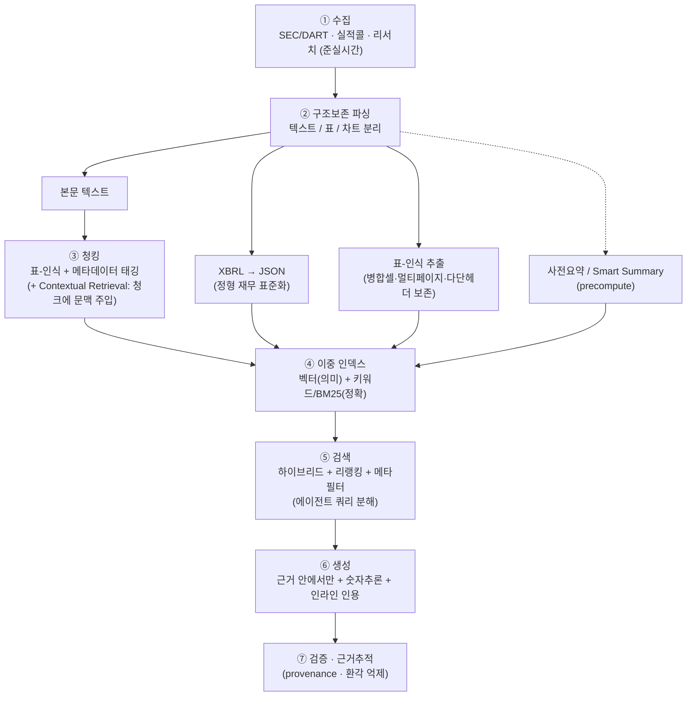
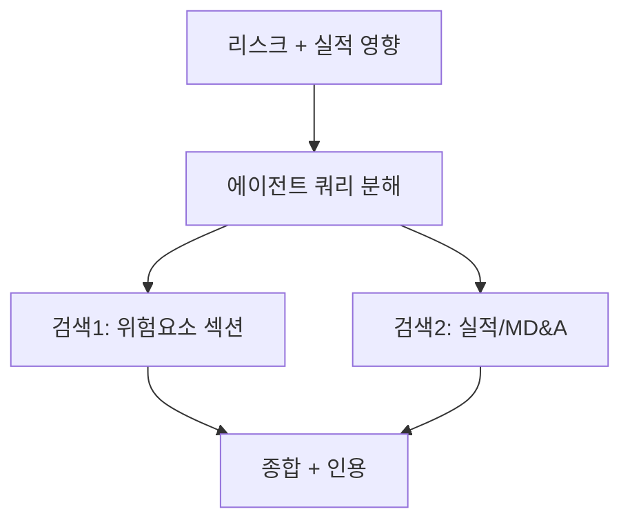

# 현업 공시분석 시스템은 실제로 어떻게 구성되나 (Production 아키텍처)

> 목적: AlphaSense·Hebbia 등 실무 공시/문서 분석 제품과 금융 RAG 연구가 **데이터 청킹·파싱부터 전체 파이프라인**을 어떻게 구성하는지 정리하고, 본 프로젝트와 비교한다.
> 작성일: 2026-06-22 · 관련: [현업_공시분석_방법론.md](현업_공시분석_방법론.md) · [AI공시요약_효율설계.md](AI공시요약_효율설계.md)

---

## 0. 한 줄 요약

> 현업 공시분석은 *"그냥 텍스트 청킹 + 벡터검색"이 아니다.* **①구조보존 파싱(특히 표·XBRL) → ②표-인식·문맥주입 청킹 → ③하이브리드 인덱스(의미+키워드) → ④에이전트 검색+리랭킹 → ⑤근거 안에서만 생성+인용+검증** 으로 돌아간다. 표/숫자/구조를 살리는 파싱과 하이브리드 검색이 진짜 차별점이다.

---

## 1. 두 가지 대표 설계 철학

| | **AlphaSense** — 정확성-우선 RAG | **Hebbia (Matrix)** — 에이전트 분해 |
|---|---|---|
| 코어 | 거대 큐레이션 코퍼스(500M+ 문서) + 하이브리드 검색 + 근거 인용 | 질문을 잘게 분해해 멀티 에이전트가 단계별 처리 |
| 검색 | 의미(임베딩) + 키워드(Boolean) 하이브리드, 도메인 모델 | "전체 문서를 통째로" + 수천 문서 동시 검색 |
| 도메인 모델 | 감성(10년 라벨링 실적콜), 회사/토픽 택소노미(엔티티 태깅) | 비전+텍스트 모델 동적 라우팅(멀티모달) |
| 산출 | Generative Search / Generative Grid, 인라인 인용, 환각 억제 | 그리드 UI(행=문서, 열=질문, 셀=에이전트 출력) |
| 에이전트 | 리서치 에이전트(2025~) | Orchestrator·Planning·Retrieval·Document analysis |

→ 한쪽은 **"잘 검색해 근거로 답"**, 다른 쪽은 **"질문을 분해해 에이전트가 단계별로"**. 실무는 둘을 섞는 추세(검색 품질 + 에이전트 오케스트레이션).

출처: [AlphaSense 작동방식(IntuitionLabs)](https://intuitionlabs.ai/articles/alphasense-platform-review), [Hebbia Matrix 소개](https://www.hebbia.com/blog/introducing-matrix-the-interface-to-agi), [Hebbia 멀티에이전트 재설계](https://www.hebbia.com/blog/divide-and-conquer-hebbias-multi-agent-redesign), [Hebbia × OpenAI](https://openai.com/index/hebbia/)

---

## 2. 공통 Production 파이프라인 (청킹·파싱부터)



### 단계별 핵심 (상세)

**① 수집(Ingestion)** — 분석할 문서를 모아 시스템에 넣는 단계.
- 공시·실적 전사록(콜 스크립트)·리서치 리포트 등을 **준실시간**으로 가져와 저장. AlphaSense는 500M+ 문서 규모.
- 쉽게: "도서관에 책을 계속 들여놓는 단계."

**② 파싱(Parsing)** — 원문을 기계가 다룰 수 있게 **구조를 살려 분해**. *공시에서 가장 어려운 단계.*
- HTML/PDF 원문에서 **텍스트 / 표(table) / 차트(그림)** 를 구분해 뽑아냄. 표는 행·열·병합셀을 보존해야 숫자가 안 망가짐.
- 쉽게: "책을 글 문단·표·그림으로 나눠 각각 알맞게 처리." (우리 프로젝트는 이걸 안 하고 전부 글자로 뭉갬 → 표 손실)

**③ 청킹(Chunking)** — 긴 문서를 검색·요약하기 좋은 **작은 조각(chunk)** 으로 자르고 꼬리표(메타데이터)를 붙임.
- 단순 글자수 자르기가 아니라 **표-인식 청킹**(표는 표 단위로) + **메타데이터 태깅**(회사·기간·섹션·공시유형 같은 꼬리표).
- **Contextual Retrieval**: 조각을 임베딩하기 전에 "이건 ACME Q2 공시의 매출 부분" 같은 **문맥 한 줄을 앞에 붙이는** 기법(Anthropic 제안). 조각이 어디서 왔는지 알려줘 검색 정밀도 +5~15%p.
- 쉽게: "책을 색인 카드로 자르되, 카드마다 '몇 장 무슨 절' 라벨을 붙인다."

**④ 인덱싱(Indexing)** — 잘게 나눈 조각을 **검색 가능한 형태**로 저장. 두 방식을 같이 씀(**하이브리드**).
- **벡터(임베딩) 검색 = 의미 검색**: 글을 숫자 벡터로 바꿔 *뜻이 비슷한 것*을 찾음. "사업 내용" 같은 **개념** 질문에 강함.
- **BM25 = 키워드 검색**: 단어가 *글자 그대로 얼마나 잘 맞는지*로 순위를 매기는 고전 알고리즘(검색엔진의 표준). 티커·정확한 숫자·고유명사 같은 **정확 일치**에 강함.
- 쉽게: 벡터검색="뜻으로 찾기", BM25="단어로 찾기". 공시는 둘 다 필요(개념+정확수치) → **하이브리드**.

**⑤ 검색(Retrieval)** — 질문이 오면 근거 조각을 꺼내옴.
- 하이브리드(벡터+BM25)로 후보를 모은 뒤 **리랭킹(re-ranking)** = 후보들을 *질문에 더 잘 맞는 순서로 다시 정렬*(보통 정밀한 별도 모델로). + **메타필터**(예: 특정 회사·기간만).
- 복잡한 질문은 **에이전트가 쿼리를 분해**(plan→retrieve→analyze): 큰 질문을 작은 검색 여러 개로 쪼개 각각 찾고 합침.
- 쉽게: "관련 카드를 잔뜩 꺼낸 뒤(검색), 가장 알맞은 순서로 추려서(리랭킹) 본다."

**⑥ 생성(Generation)** — 꺼낸 근거로 답을 만든다.
- **검색된 근거 안에서만** 답(accuracy-first → 환각↓), **표/숫자 추론**, **인라인 인용**(답에 출처를 바로 표시).

**⑦ 검증(Verification)** — 답이 근거에 충실한지 점검.
- **근거추적(provenance)** = 답의 각 주장이 *어느 원문에서 왔는지 되짚기*. 환각 억제·감사가능성 → 금융권 필수.

> 출처: [AlphaSense(IntuitionLabs)](https://intuitionlabs.ai/articles/alphasense-platform-review), [Anthropic Contextual Retrieval](https://www.anthropic.com/news/contextual-retrieval), [Document Parsing for Production RAG(Medium)](https://medium.com/@manikandan_t/document-parsing-for-production-rag-architecture-tradeoffs-and-when-to-use-what-7a89ab0af7b7)

### 용어 한눈에 (Glossary)

| 용어 | 쉬운 뜻 | 강점/용도 |
|---|---|---|
| **청킹(Chunking)** | 긴 문서를 작은 조각으로 자름 | 검색·요약 단위 만들기 |
| **메타데이터 태깅** | 조각에 회사·기간·섹션 등 꼬리표 부착 | 필터·랭킹 정확도 |
| **임베딩/벡터 검색** | 글을 숫자벡터로 바꿔 '뜻'으로 찾기 | 개념·서술 질문 |
| **BM25** | 단어 일치도로 순위 매기는 키워드 검색(고전 표준) | 티커·정확 수치·고유명사 |
| **하이브리드 검색** | 벡터(뜻) + BM25(단어)를 함께 | 둘의 강점 결합 |
| **리랭킹(Re-ranking)** | 검색 후보를 더 정밀히 재정렬 | 상위 정확도↑ |
| **Contextual Retrieval** | 조각에 출처 문맥을 한 줄 붙여 임베딩 | 검색 정밀도↑(Anthropic) |
| **RAG** | 검색해서 찾은 근거로 LLM이 답(검색증강생성) | 환각↓·근거 기반 |
| **XBRL** | 재무제표를 기계가 읽는 표준 태그 형식 | 정형 재무 데이터 |
| **에이전트(Agent)** | 작업을 단계로 나눠 스스로 수행하는 LLM | 복잡 질문 분해·다단계 |
| **provenance(근거추적)** | 답이 어느 원문에서 왔는지 되짚기 | 검증·감사 |

---

## 3. 공시 특유의 난제 (왜 청킹·파싱이 특별한가)

| 난제 | 실무 대응 | 출처 |
|---|---|---|
| 표가 페이지를 넘어가고, 병합셀·다단 헤더·계산 종속성 | **표-인식 청킹**, 구조 보존 파싱, 의미+정확매칭 동시 | [Daloopa — 재무 표 RAG](https://daloopa.com/blog/analyst-best-practices/rag-systems-for-financial-tables-enhancing-excel-data-with-ai-context), [Captide](https://www.captide.ai/insights/how-to-turn-financial-reports-into-machine-readable-documents-for-rag) |
| 정형 재무(XBRL) vs 비정형 텍스트 혼재 | XBRL을 JSON으로 표준화 + 텍스트는 RAG | [edgartools ParsingXBRL](https://github.com/dgunning/edgartools/wiki/ParsingXBRL), [sec-api XBRL 추출](https://sec-api.io/resources/extract-financial-statements-from-sec-filings-and-xbrl-data-with-python) |
| 숫자 정확성·계산·교차검증 | 정확매칭 검색 + 숫자추론 + 검증 단계 | [MimirRAG(arXiv 2605.25030)](https://arxiv.org/html/2605.25030v1), [FinSage(arXiv 2504.14493)](https://arxiv.org/pdf/2504.14493) |
| 멀티모달(차트·이미지·덱) | 비전 모델로 라우팅해 파싱·추론 | [Hebbia Matrix](https://www.hebbia.com/blog/introducing-matrix-the-interface-to-agi) |
| 대형 문서 전체 맥락 | 계층 요약(RAPTOR), 사전요약 인덱스 | [RAPTOR(arXiv 2401.18059)](https://arxiv.org/abs/2401.18059) |

> 한국(DART)은 PDF/HTML 비중이 커 **원문 파싱 부담이 큼**(OpenDART는 정형·XBRL은 주지만 본문/주석 텍스트는 원문 파싱 필요). 표·주석 추출 품질이 곧 분석 품질.

---

## 4. 표준 기법 — 출처 정리

| 기법 | 내용 | 명백한 출처 |
|---|---|---|
| **Contextual Retrieval** | 임베딩 전 청크에 문서 문맥 주입 | [Anthropic](https://www.anthropic.com/news/contextual-retrieval) |
| **Document Summary Index** | 문서별 요약을 미리 만들어 검색에 사용 | [LlamaIndex](https://www.llamaindex.ai/blog/a-new-document-summary-index-for-llm-powered-qa-systems-9a32ece2f9ec) |
| **RAPTOR(계층 요약)** | 재귀 클러스터+요약 트리로 다중 granularity 검색 | [arXiv 2401.18059](https://arxiv.org/abs/2401.18059) |
| **Map-Reduce 요약** | 청크별 요약(map) → 통합(reduce), 대형문서·병렬 | [Google Cloud](https://cloud.google.com/blog/products/ai-machine-learning/long-document-summarization-with-workflows-and-gemini-models) |
| **멀티에이전트 금융 RAG** | 메타데이터·표-인식·쿼리계획·검증 | [MimirRAG](https://arxiv.org/html/2605.25030v1), [FinSage](https://arxiv.org/pdf/2504.14493) |
| **한국 공시 LLM 모니터링** | KOSPI50 공시를 LLM으로 의미 모니터링(사례연구) | [arXiv 2309.00208](https://arxiv.org/pdf/2309.00208) |

---

## 5. 본 프로젝트(`gongsi-agent`)와 비교

| 단계 | 현업 production | 본 프로젝트 | 격차 |
|---|---|---|---|
| 파싱 | 구조보존 + **표-인식** + XBRL | 텍스트 위주, DART 재무 인용(부분) | 표-인식 파싱 약함 ⚠️ |
| 청킹 | 표-인식 + 메타 + **Contextual** | 섹션 청킹 + 메타(○) | Contextual 미적용 |
| 인덱스 | **하이브리드(벡터+BM25)** + 리랭킹 | 벡터 + 키워드폴백 + 도메인 리랭크(부분○) | 본격 하이브리드/리랭킹 보강 여지 |
| 재무 | XBRL 정형 표준화 | DART 재무 인용(부분○) | XBRL 정형화 여지 |
| 검색 | 에이전트 **쿼리 분해** | 단일 라우팅(요약/QA) | 쿼리 분해·하이브리드 트랙 ⚠️ |
| 생성 | 근거內 + 인용 + 검증 | 근거內 + verdict/groundedScore(○) | — |
| 요약 | Smart Summary(precompute) | 사전요약(서술, precompute)(○) | — |

### 결론 — 우리의 위치
- **갖춘 것**: RAG + 사전요약 + 라우팅 + 근거검증의 **기본 뼈대**. 현업 정확성-우선 RAG의 축소판.
- **보강 포인트(우선순위)**: ① 하이브리드 검색 + 리랭킹 ② 표-인식 파싱/XBRL 정형화 ③ Contextual Retrieval ④ 에이전트 쿼리 분해(혼합 질문 대응).
- 즉 본 프로젝트는 *"현업 공시분석 AI의 라이트·국내(DART)·대화형 버전"* 이며, 위 4가지가 현업 수준으로 가는 로드맵이다.

---

## 6. 시나리오로 보는 파이프라인 (예시)

같은 시스템이라도 **질문 종류에 따라 파이프라인의 다른 부분이 주역**이 된다. 4가지 예시로 본다.

### 시나리오 A — "삼성전자 작년 영업이익 얼마야?" (정확 수치)

- **주역**: BM25 + 표/XBRL. 숫자·고유명사는 *단어 정확 일치*가 중요해 벡터(뜻) 검색만으론 부족.
- **표-인식이 없으면?** 표가 plaintext로 뭉개져 엉뚱한 숫자를 집거나 놓침. → 우리 프로젝트의 약점(G1).

### 시나리오 B — "삼성전자 사업 내용 요약해줘" (서술/개념)

- **주역**: 벡터(의미) 검색 + 사전요약(precompute). '사업 내용'이라는 *개념*에 가까운 조각을 찾음.
- 정확 수치가 굳이 필요 없으니 **싼 모델 사전요약으로 충분**(우리 프로젝트가 이미 적용).

### 시나리오 C — "지역별 매출 알려줘" (표가 핵심)
```mermaid
flowchart LR
    Q["지역별 매출"] --> P{"표-인식 파싱?"}
    P -->|있음(현업)| OK["표 구조 보존<br/>→ 지역×매출 정확"]
    P -->|없음(현재 우리)| BAD["plaintext로 뭉갬<br/>→ 행/열 깨짐·부정확"]
```
- **주역**: 파싱(②)·표-인식 청킹(③). 표는 행·열 의미가 살아야 "지역별"이 성립.
- 현업은 표를 표로 다루지만, **우리는 plaintext라 이 질문이 취약**. → 개선책 ③(표 블록 분리)·①(풀 파서)의 동기.

### 시나리오 D — "최근 공시 중 리스크 요인과 그게 실적에 준 영향은?" (복합)

- **주역**: 에이전트 쿼리 분해(⑤). 한 번의 검색으론 두 주제를 다 못 담아 **여러 검색으로 쪼갠 뒤 합침**.
- 단일 라우팅만 있는 **우리 프로젝트는 이런 복합/혼합 질문에 약함**(G6). → 개선책 ②의 '하이브리드 트랙', ①의 '에이전트 분해'가 이를 겨냥.

> 정리: **A=BM25·표 / B=벡터·요약 / C=표-인식 파싱 / D=에이전트 분해.** 좋은 공시분석 시스템은 이 네 상황을 *모두* 잘 처리하도록 파이프라인 각 단계를 갖춘다.

---

## 7. 사전요약은 "무엇을" 뽑나 — Takeaway 선정 · 토픽 추출

> §2의 점선 노드 **사전요약(precompute / Smart Summary)** 이 실제로 *무엇을 핵심으로 골라* 요약하는지의 방법론.
> 배경: 질문마다 매번 요약하면 느리고 비싸므로 **적재 때 미리 요약해 저장 → 질문 시 꺼내 쓰는** 효율화 기법. "효율적 업무처리를 위해 미리 요약해 활용"이 바로 이것. 사례: AlphaSense Smart Summary, [LlamaIndex Document Summary Index](https://www.llamaindex.ai/blog/a-new-document-summary-index-for-llm-powered-qa-systems-9a32ece2f9ec), 본 프로젝트 `summary_*`.

요약의 품질은 **① 무슨 주제인지(토픽 추출) ② 그중 무엇이 중요한지(takeaway 선정)** 를 얼마나 잘 잡느냐로 갈린다.

### 7-1. 토픽 추출 — "이 문서가 무슨 주제들인가"
| 방식 | 어떻게 | 특징 |
|---|---|---|
| **택소노미 + 분류기**(지도) | 미리 정의한 주제 체계(가이던스·CapEx·M&A·소송 등)에 ML 분류기·NER로 태깅 | 일관·감사가능·확장. **AlphaSense "Company Topics"** |
| **비지도 토픽모델링** | **BERTopic**(임베딩→UMAP→HDBSCAN 군집→c-TF-IDF 라벨), 구식 LDA | 주제 수 미지정 가능, 신규 주제 발견 |
| **LLM 기반/하이브리드** | LLM이 직접 토픽 추출·라벨, 또는 BERTopic+LLM(라벨·중복병합) | 유연·고품질, 비용↑ |
| **도메인 모델** | FinBERT/FinBERT2로 금융 뉘앙스 포착 | 금융 특화 |

### 7-2. Takeaway 선정 — "그중 무엇이 중요한가"
| 방식 | 무엇을 "중요"로 보나 | 비고 |
|---|---|---|
| **추출적 salience** | 문장 그래프 중심성(TextRank/LexRank)으로 대표 문장 | 원문 그대로 → 투명·환각 없음 |
| **추상적/LLM** | LLM이 핵심 takeaway 생성(프롬프트·few-shot) | 읽기 쉬움, 환각 위험 |
| **감성·톤 신호** | 감성 강함/톤 변화 큰 부분 | AlphaSense 감성모델(10년 라벨 실적콜) |
| **이벤트 트리거** | 가이던스·CapEx·M&A·소송·경영진 변경 등 material 키워드 | 이벤트 드리븐 |
| **변화/신규성 탐지** | 직전 공시 대비 바뀐/새로 추가된 내용 | 신규 위험요소·가이던스 변경 |
| **질문 주도(query-driven)** | 표준 애널리스트 질문에 답을 추출 | AlphaSense Generative Grid, Hebbia 분해 |
| **섹션 가중** | MD&A·위험요소·주석 우선 | 애널리스트 휴리스틱 |

### 7-3. 두 가지 철학
- **지도/택소노미형**(AlphaSense): 정해진 주제 체계 + 분류기 + 감성 + 이벤트 키워드 → 결정적·감사가능·대규모.
- **생성/질문주도형**(Hebbia·Grid): LLM이 질문을 분해해 그때그때 takeaway 추출 → 유연.
- 실무는 보통 **둘을 혼합 + 도메인모델 + 근거추적(provenance)**.

### 7-4. 본 프로젝트와의 차이 (Gap)
우리 사전요약은 **takeaway 선정 로직이 사실상 없음** — 목차 묶음을 *균일하게* 요약할 뿐, 중요도 가중(salience·감성·이벤트·변화)·토픽 태깅이 없다. 끌어올리는 단계(난이도순):
1. **(저비용)** 요약 프롬프트에 "핵심 takeaway·주요 토픽 위주" 지시 + 섹션 가중(MD&A·위험요소 우선).
2. **(중간)** 토픽 태깅(택소노미 분류 또는 BERTopic)으로 묶음에 주제 라벨 → 검색·필터 강화(묶음 제목 깨짐도 해결).
3. **(고급)** 변화 탐지(직전 정기보고서 대비 새 위험·가이던스 변경) + 이벤트 트리거로 "이번 공시의 진짜 새 소식"을 takeaway로.

> 출처: [Extractive vs abstractive·ECT-SKIE(ScienceDirect)](https://www.sciencedirect.com/science/article/abs/pii/S0306457324003571), [Agentic Retrieval of Topics & Insights(arXiv 2507.07906)](https://arxiv.org/pdf/2507.07906), [Modeling analysts via earnings calls(arXiv 1906.02868)](https://arxiv.org/pdf/1906.02868), [BERTopic](https://maartengr.github.io/BERTopic/getting_started/representation/llm.html), [LLM 토픽모델링(arXiv 2403.16248)](https://arxiv.org/pdf/2403.16248), [FinBERT2(arXiv 2506.06335)](https://arxiv.org/pdf/2506.06335)

---

## 8. 핵심 출처 모음
- AlphaSense: [작동방식(IntuitionLabs)](https://intuitionlabs.ai/articles/alphasense-platform-review), [Generative AI for Investment Research](https://www.alpha-sense.com/solutions/generative-ai-investment-research/)
- Hebbia: [Matrix 소개](https://www.hebbia.com/blog/introducing-matrix-the-interface-to-agi), [멀티에이전트 재설계](https://www.hebbia.com/blog/divide-and-conquer-hebbias-multi-agent-redesign)
- 금융 RAG 연구: [MimirRAG(2605.25030)](https://arxiv.org/html/2605.25030v1), [FinSage(2504.14493)](https://arxiv.org/pdf/2504.14493), [한국 KOSPI50 LLM 공시 모니터링(2309.00208)](https://arxiv.org/pdf/2309.00208)
- 표/XBRL 파싱: [Daloopa](https://daloopa.com/blog/analyst-best-practices/rag-systems-for-financial-tables-enhancing-excel-data-with-ai-context), [Captide](https://www.captide.ai/insights/how-to-turn-financial-reports-into-machine-readable-documents-for-rag), [edgartools](https://github.com/dgunning/edgartools/wiki/ParsingXBRL)
- 기법: [Anthropic Contextual Retrieval](https://www.anthropic.com/news/contextual-retrieval), [LlamaIndex Document Summary Index](https://www.llamaindex.ai/blog/a-new-document-summary-index-for-llm-powered-qa-systems-9a32ece2f9ec), [RAPTOR(2401.18059)](https://arxiv.org/abs/2401.18059)
