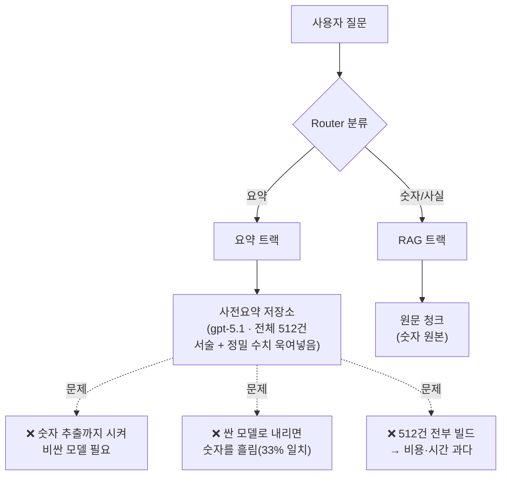
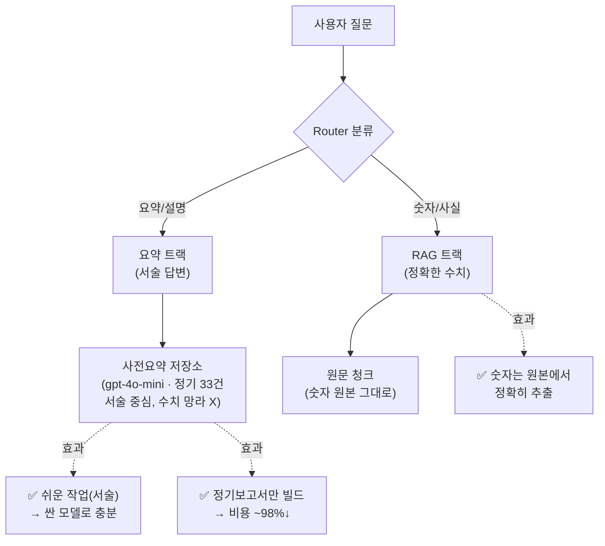
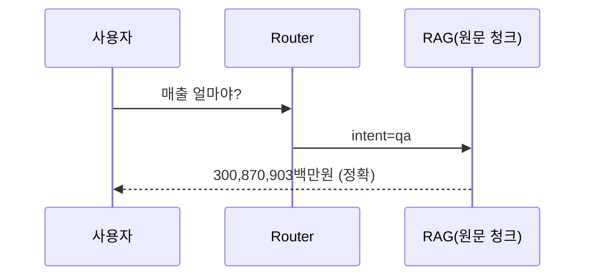
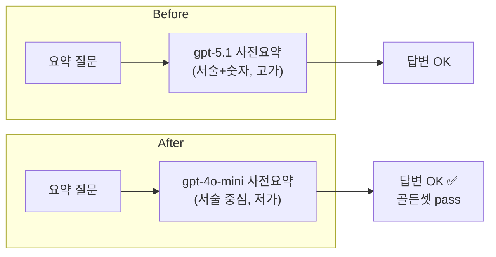
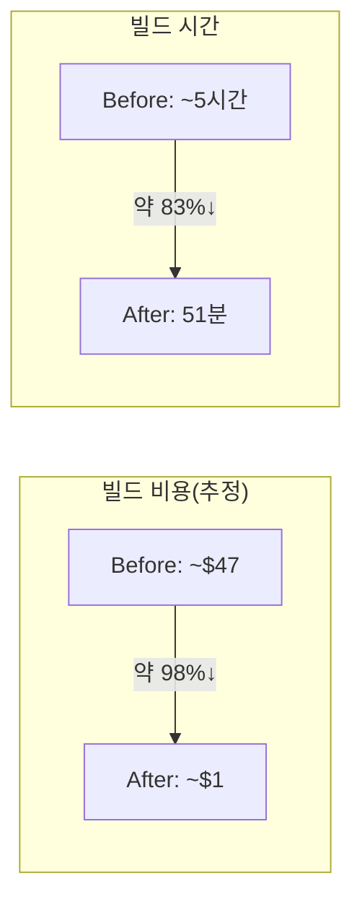

# 요약 기능 변경 — Before / After 비교 보고서

> 이번 변경의 **기존(Before) vs 신규(After)** 를 구조·동작·비용·품질 관점에서 비교한다.
> 작성일: 2026-06-22 · 브랜치: `dev` · 관련: [성과보고서](요약기능_개선_성과보고서.md) · [모델 A/B](요약모델_비교분석_보고서.md) · [종합보고서](요약기능_개선_종합보고서.md)

---

## 0. 한눈에 보기

| 구분 | Before(기존) | After(신규) |
|---|---|---|
| 요약의 역할 | 서술 **+ 정밀 수치까지** 모두 | **서술만** (숫자는 RAG가 담당) |
| 요약 모델 | gpt-5.1 (고가) | **gpt-4o-mini** (저가) |
| 빌드 대상 | 전체 공시 **512건** | **정기보고서 33건**만(나머지는 RAG 폴백) |
| 묶음 상한(max_sections) | 40 | **20** |
| 요약 검색 top_k | 4 | **8** |
| 빌드 비용/시간 | ~$47 / ~5시간 (추정) | **~$1 / 51분** (실측) |
| 답변 품질 | 기준 | 골든셋 **must 12/12 통과** |

---

## 1. 구조 비교 (다이어그램)

### Before — 요약이 "숫자까지" 책임짐


### After — "숫자는 RAG, 요약은 서술"로 역할 분리


**핵심 차이**: Before는 요약 하나에 "서술 + 숫자"를 다 맡겨 비싼 모델이 필요했고 싼 모델은 숫자를 흘렸다. After는 **숫자를 RAG로 떼어내** 요약을 "서술만 하는 쉬운 작업"으로 만들어, 싼 모델로도 품질을 유지한다.

---

## 2. 질문 처리 흐름 비교

### "작년 매출 얼마야?" (숫자 질문) — 변화 없음(원래 RAG가 잘함)


### "사업 내용 요약해줘" (서술 질문) — 모델만 교체, 품질 유지


---

## 3. 무엇을 바꿨나 (파일/설정)

| 파일·설정 | Before | After | 의미 |
|---|---|---|---|
| `crew.py: summarize_text` 프롬프트 | "수치·일자 사실 위주로 망라" | "서술 중심, 메타설명 금지, 수치 망라 X(숫자는 RAG)" | 요약에서 숫자 책임 제거 |
| `config.py: summary_top_k` | 4 | 8 | 요약 검색 recall 보강 |
| `build_summaries.py` 기본 대상 | 전체 공시 | 정기보고서만(+`--all`/`--dry-run`) | 선택적 빌드 |
| `.env: SUMMARY_MODEL` (권장) | gpt-5.1 | gpt-4o-mini | 요약 단가↓ (QA·검증은 gpt-5.1 유지) |
| `.env: SUMMARY_MAX_SECTIONS` (권장) | 40 | 20 | 묶음 수↓ |

> RAG 트랙·검증(gpt-5.1)은 그대로. 변경은 **요약 트랙(프롬프트·설정·빌드 스크립트)** 에 국한.

---

## 4. 비용·품질 비교 (실측 반영)



| 지표 | Before(추정) | After(실측) | 변화 |
|---|---|---|---|
| 대상 공시 | 512건 | 33건 | 정기보고서 집중 |
| 요약(LLM 호출) | ~3,311 | 486 | ~85%↓ |
| 빌드 시간 | ~5시간 | 51분 | ~83%↓ |
| 빌드 비용 | ~$47 | ~$1 | ~98%↓ |
| 답변 품질 | 기준 | 골든셋 must 12/12 통과 | 유지 |

> 절대 금액은 추정치(±) — 감소율(%)이 핵심 지표. 단가: gpt-5.1 $1.25/$10 · gpt-4o-mini $0.15/$0.60.

---

## 5. 트레이드오프 / 알려진 한계

| 항목 | 내용 |
|---|---|
| 정기보고서 외 공시 | 사전요약 안 함 → 첫 질문 시 실시간 RAG로 생성(조금 느림). 저가치·정량 위주라 영향 작음 |
| 라우팅 약점(watch) | "무슨 사업 해?"(요약 단어 없는 질문)가 아직 `qa`로 빠질 수 있음 → 골든셋 watch 2건. 백로그 |
| 요약 검색 랭킹 | "회사 개요" 질문이 회계 섹션을 일부 끌어옴 → 섹션 제목 품질·쿼리 확장 개선 여지 |
| 숫자 기대값 | 골든셋 숫자값은 2024~2025 공시 기준 → 신규 보고서 적재 시 갱신 필요 |

---

## 6. 검증 결과 (3-트랙 챗 골든셋, 14케이스)

```
must  : 12/12 통과 ✅   (요약 서술 / 숫자 RAG / 스코프 가드)
watch :  0/2          (라우팅 약점 — 알려진 개선거리)
```
→ 핵심 변경("싼 모델 요약 + 숫자 RAG")이 삼성·현대 양쪽에서 의도대로 작동함을 자동 검증. (실행: `python -m eval.run_chat_golden`)

---

## 7. 결론

Before는 "요약이 숫자까지 떠안아" 비싸거나 부정확했고, After는 **역할을 RAG(숫자)·요약(서술)로 분리**해 **싼 모델 + 정기보고서 집중**으로 **빌드 비용을 약 98% 줄이면서 품질을 유지**했다. 변경은 요약 트랙의 프롬프트·설정·빌드 스크립트에 국한되어 서비스 로직 위험이 없다.
