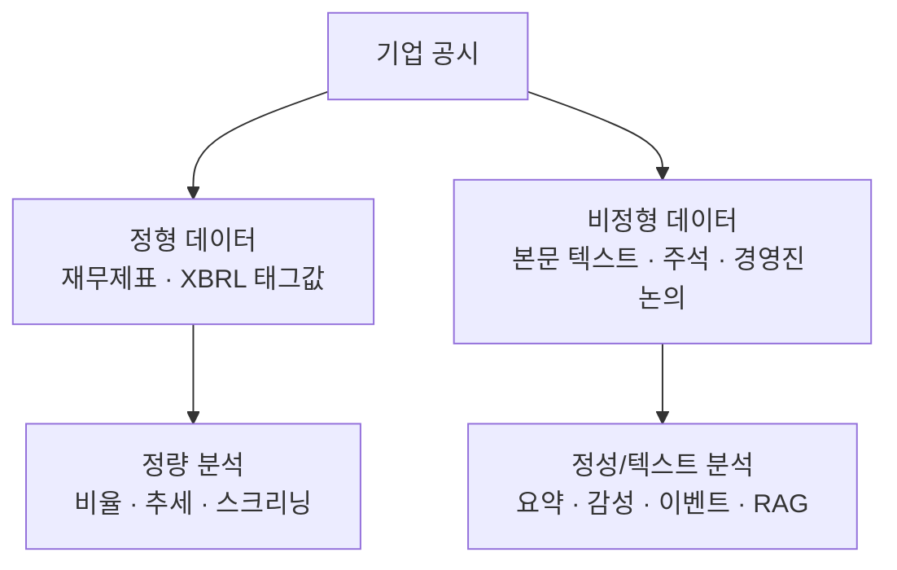
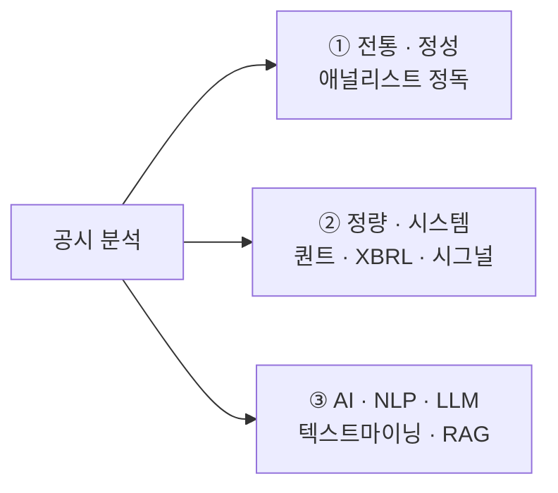
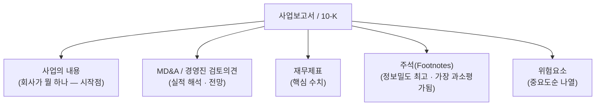
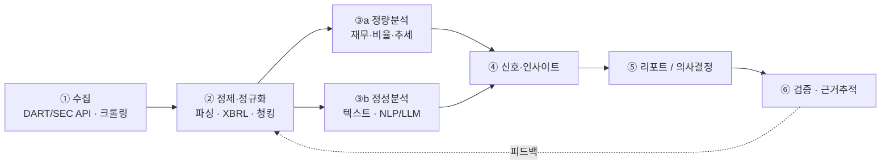
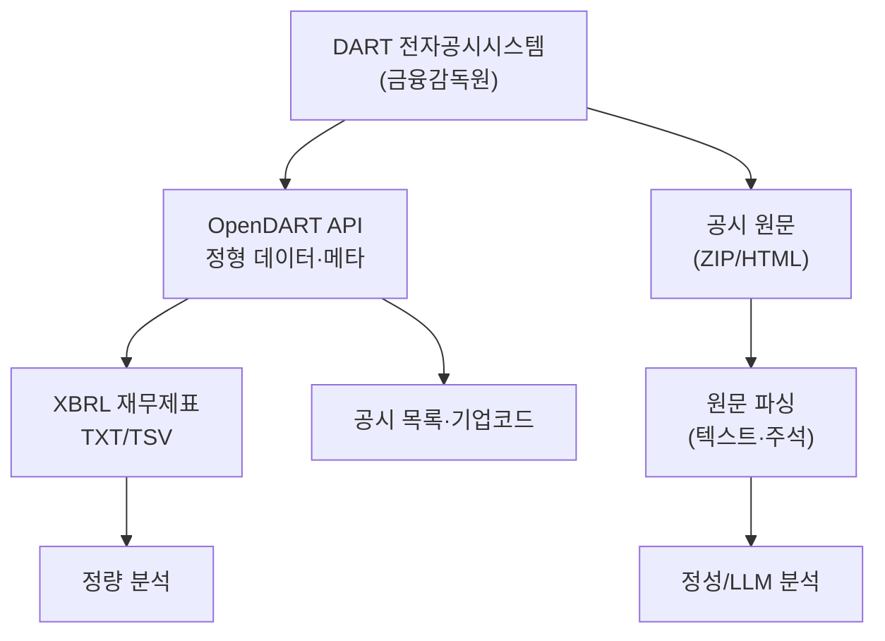
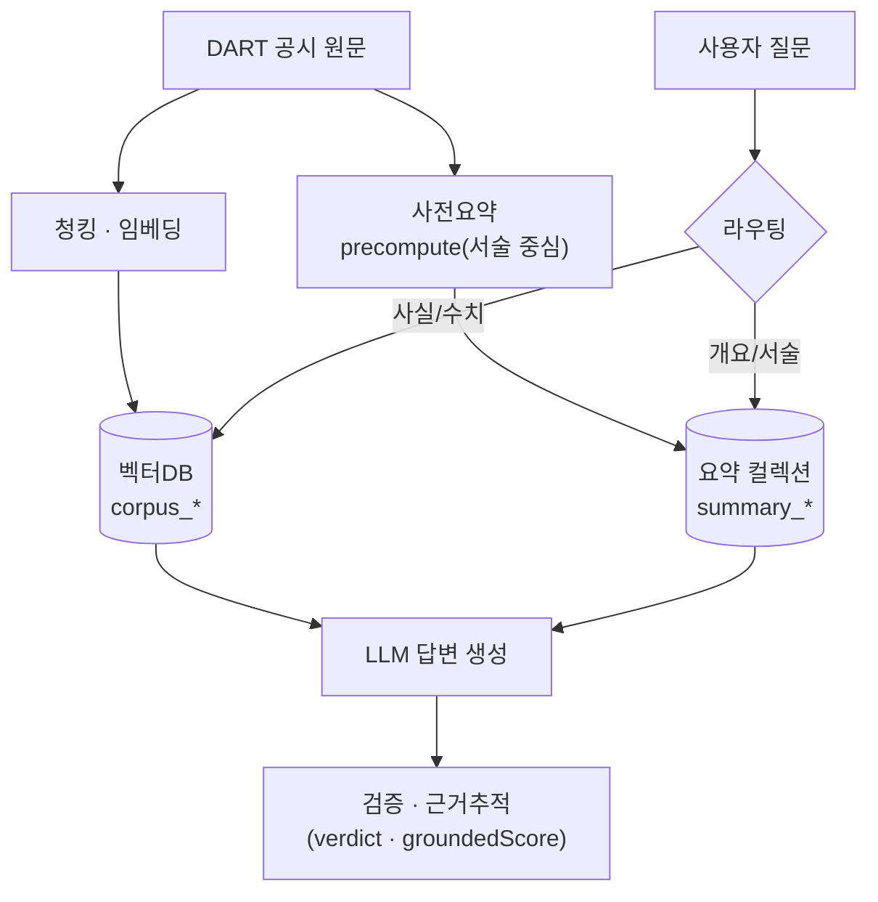

# 현업에서 공시분석은 어떻게 이루어지는가 (방법론 개관)

> 목적: 기업 공시(disclosure) 분석이 실무에서 어떤 데이터·접근·파이프라인으로 수행되는지 정리하고, 본 프로젝트(`gongsi-agent`)가 그 지형에서 어디에 위치하는지 보인다.
> 작성일: 2026-06-22 · 성격: 도메인 참고 문서(레퍼런스). 출처는 §8.

---

## 1. 공시분석이란

상장사는 사업·재무·지배구조·중요사건을 **법적으로 공개(공시)** 해야 한다(한국 DART, 미국 SEC EDGAR 등). 공시분석은 이 문서들에서 **투자·신용·감사·리서치 판단에 필요한 사실과 신호를 추출**하는 작업이다. 크게 두 종류의 데이터를 다룬다.

- **정형(structured)**: 숫자·코드. XBRL로 태깅되어 기계가 바로 읽음. 비율·추세·동종비교에 강함.
- **비정형(unstructured)**: 사업의 내용, 경영진 논의(MD&A), 주석, 위험요소 같은 **서술 텍스트**. 맥락·의도·리스크가 여기 있다. 과거엔 사람만 읽었으나 지금은 NLP/LLM이 다룬다.

---

## 2. 세 가지 접근 방식

| 축 | 누가/어떻게 | 강점 | 한계 |
|---|---|---|---|
| **① 전통/정성** | 리서치 애널리스트가 직접 정독, Bloomberg·FactSet·Refinitiv로 보조 | 맥락·뉘앙스·전망 해석 | 느림, 커버리지 한정, 주관 |
| **② 정량/시스템** | 퀀트팀이 XBRL 재무·이벤트를 규칙/모델로 처리 | 대규모·일관·재현 가능 | 텍스트의 의미를 못 봄, 정형에 의존 |
| **③ AI/NLP/LLM** | text mining·FinBERT·RAG·요약/감성/이벤트 탐지 | 텍스트를 **대규모로** 빠르게, 질의응답 | 환각·근거추적·감사가능성 과제 |

> 현업은 셋을 **혼합**한다. 정량(②)이 스크리닝하고, 텍스트(③)가 신호를 보강하며, 애널리스트(①)가 최종 판단·책임을 진다.

---

## 3. 애널리스트는 공시의 어디를 보나 (정성 분석의 핵심)

사업보고서/10-K에서 실무자가 중점적으로 읽는 부분(중요도·정보밀도 순):

- **주석(Footnotes)** 이 가장 정보가 많다(부외부채·특수관계자거래·회계정책·소송·세그먼트). "헤드라인 재무제표만 보고 주석을 건너뛰면 공시의 절반도 못 본다"는 게 정설.
- **MD&A**는 경영진이 숫자를 *어떻게 해석*하고 *무엇을 전망*하는지 담아 정성 분석의 핵심.

---

## 4. 표준 공시분석 파이프라인

수작업이든 자동화든 대체로 같은 단계를 거친다.

1. **수집**: 적시공시·정기보고서를 API/크롤링으로 모음. (이벤트 드리븐: 하루치 공시 스트림을 감시해 "대표이사 사임", "대규모 손실" 같은 키워드 포착)
2. **정제**: HTML/ZIP 원문 파싱, XBRL 매핑, 텍스트 청킹.
3. **분석**: 정량(재무 비율·동종비교)과 정성(요약·감성·이벤트·QA)을 병행.
4. **신호**: 밸류에이션 입력, 리스크 플래그, 사건 알림 등.
5. **리포트/판단**: 투자·신용·감사 결정.
6. **검증**: 근거(원문 위치) 추적·감사가능성 — 특히 금융권에서 필수.

---

## 5. 한국 맥락 — DART / OpenDART / XBRL

- **DART**: 한국 상장·주요 비상장사의 법정 공시를 누구나 조회. **OpenDART**는 그 데이터를 주는 개발자 API.
- **OpenDART의 강점/한계**: 숫자·코드(정형)와 XBRL 재무는 잘 주지만, **본문·주석 텍스트는 API로 안 줌 → 원문(ZIP/HTML)을 직접 받아 파싱**해야 함. **일 호출 1만 건 제한**이 있어 전체 상장사·전기간 수집은 설계가 필요.
- 도구 생태계: `OpenDartReader`(파이썬) 등으로 수집을 단순화.

---

## 6. AI/LLM 기반 분석 (요즘 트렌드)

텍스트(③) 축에서 최근 2024~2026 실무·연구가 빠르게 움직이는 영역.

| 기법 | 무엇 | 용도 |
|---|---|---|
| **도메인 임베딩/모델** | FinBERT, BloombergGPT | 금융 텍스트 분류·감성 |
| **RAG** | 검색증강생성: 공시를 청킹·임베딩 후 질문 시 관련 근거를 찾아 LLM이 답 | 공시 Q&A, 사실 추출 |
| **요약(precompute)** | 섹션/문서 요약을 미리 생성·저장 | 빠른 개요 제공 |
| **이벤트·감성 탐지** | 하루치 공시 배치 스캔 → 주요 이벤트 요약 | 모니터링·알림 |
| **시그널화** | 텍스트 특징(가독성·톤)을 투자 신호로 | 정량 모델 입력 |

> 연구 흐름: LLM이 추출한 텍스트 특징이 시장 반응과 상관(공시가 읽기 어려운 기업은 페널티), 10-Q처럼 잦은 보고로 사내 상황·경영진 톤 변화를 세밀히 추적 가능. 다만 **환각·근거추적·감사가능성**이 핵심 과제라 "auditable LLM-RAG"(근거를 원문으로 되짚는 구조)가 강조된다.

---

## 7. 이 프로젝트(`gongsi-agent`)는 어디에 있나

본 프로젝트는 **③ AI/NLP 축의 RAG + 사전요약(precompute) 구현체**다. 즉 위 표준 파이프라인을 한국 DART 공시에 적용한 한 사례.

| 표준 단계 | 본 프로젝트 대응 |
|---|---|
| 수집 | OpenDART API + 원문 파싱(`app/data/dart.py`) |
| 정제 | 섹션 청킹(`chunker.py`), 임베딩(`embedder.py`) |
| 정량 | 재무 인용(`financials.py`) + 거시(ECOS, `macro.py`) |
| 정성 | RAG 검색 + 사전요약(서술) + QA(`chat.py`, `summarize.py`) |
| 검증 | 검증 에이전트 — verdict/groundedScore (auditable RAG에 해당) |

→ 즉 우리가 한 "숫자는 RAG, 요약은 서술" 분리는 **정량(②)·정성(③) 강점을 트랙으로 나눠 쓰는** 현업 혼합 전략의 축소판이다. (상세: [요약기능_변경_비교보고서.md](요약기능_변경_비교보고서.md))

---

## 8. 출처

- 10-K/공시 정독 실무: [Investor.gov — How to Read a 10-K](https://www.investor.gov/introduction-investing/getting-started/researching-investments/how-read-10-k), [Minalyst — Analyze a 10-K](https://minalyst.com/blog/research-guides/how-to-analyze-10k-filing), [FMP — Analyze an Annual Report](https://site.financialmodelingprep.com/education/financial-analysis/how-to-analyze-an-annual-report-k-like-an-investor)
- AI/LLM·RAG 공시분석: [LLMs in Financial NLP (arXiv 2507.22936)](https://arxiv.org/html/2507.22936v1), [LLM Analysis of 10-K/10-Q: RAG Results](https://www.researchgate.net/publication/377746616_LLM_Analysis_of_10-K_and_10-Q_Filings_RAG_Results), [Auditable LLM-RAG for Financial Documents (MDPI)](https://doi.org/10.3390/fi18060284), [IntuitionLabs — LLMs for Financial Document Analysis](https://intuitionlabs.ai/articles/llm-financial-document-analysis)
- 퀀트·텍스트 시그널: [Bloomberg — Data, Tech & AI in Quant Investing](https://www.bloomberg.com/professional/insights/data/maximizing-alpha-harnessing-data-technology-ai-in-quant-investing/), [Words Matter: Forecasting Downside Risks with Corporate Textual Data (arXiv 2511.04935)](https://arxiv.org/pdf/2511.04935)
- 한국 DART/OpenDART: [OpenDART](https://opendart.fss.or.kr/), [OpenDartReader (GitHub)](https://github.com/FinanceData/OpenDartReader), [DartLab — DART의 모든 것](https://eddmpython.github.io/dartlab/blog/everything-about-dart)
