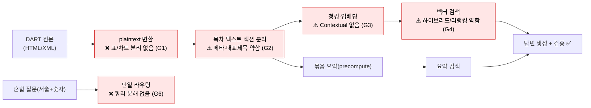
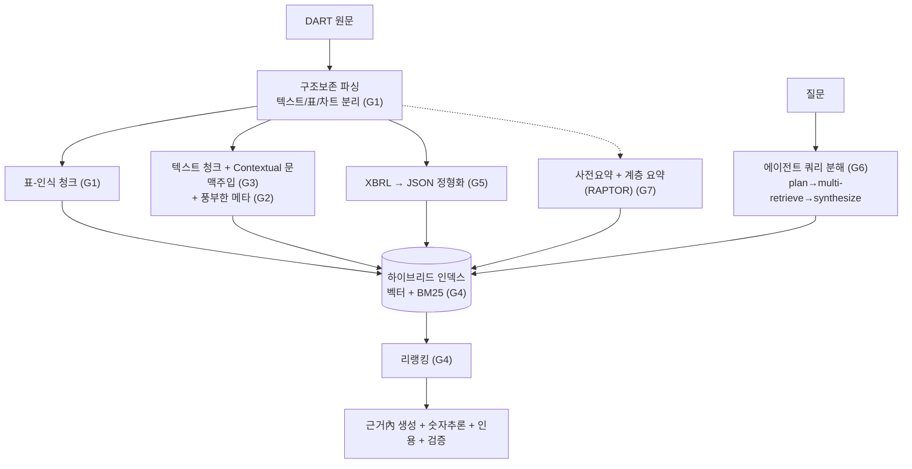
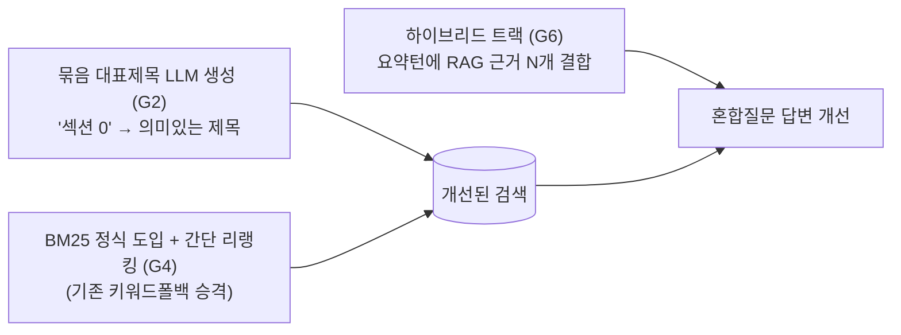
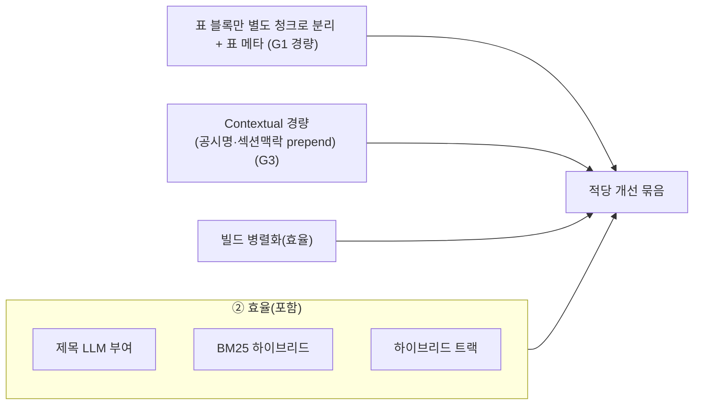
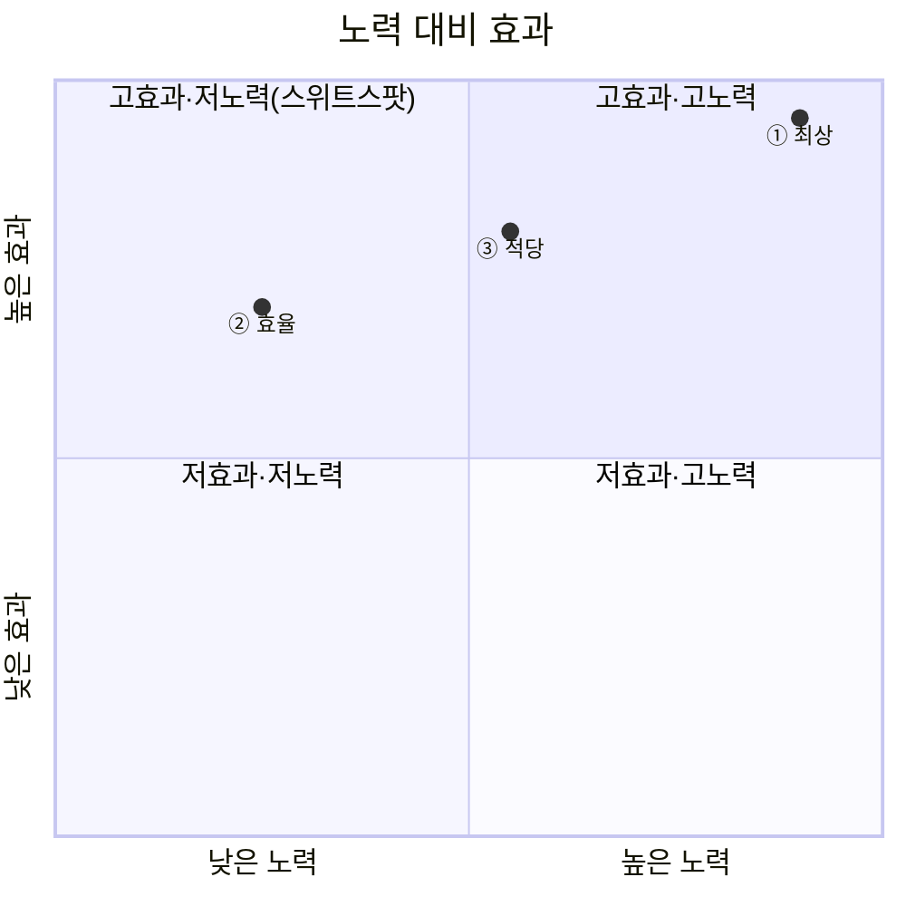

# 현업 대비 부족한 점 + 3가지 개선책 (최상 · 효율 · 적당)

> 목적: 본 프로젝트(`gongsi-agent`)를 현업 공시분석 production 아키텍처와 비교해 **부족한 점**을 진단하고, **① 최상 · ② 효율 · ③ 적당** 세 가지 개선 전략을 제시한다.
> 작성일: 2026-06-22 · 관련: [공시분석_production_아키텍처.md](공시분석_production_아키텍처.md) · [AI공시요약_효율설계.md](AI공시요약_효율설계.md)

---

## 0. 먼저 — 현재 사전요약은 "표/차트 분리" 안 한다

| | 현업(production) | 본 프로젝트(현재) |
|---|---|---|
| 파싱 | 텍스트/표/차트 **분리**, 표는 구조 보존 | DART 원문을 **plaintext로 변환** |
| 요약 단위 | 구조 인식된 단위 | **목차 텍스트 섹션 묶음**(표는 plaintext로 섞임) |

→ 즉 우리 사전요약은 "텍스트 기반으로 잘라 요약"이며, **표는 행이 풀어헤쳐진 plaintext로 들어가 구조·정확성이 손실**된다. 이것이 가장 큰 차이.

---

## 1. 현재 파이프라인 + 부족한 지점

### 부족한 점(Gap) 목록
| ID | 부족한 점 | 영향 |
|---|---|---|
| **G1** | 표-인식 파싱 없음(표=plaintext) | 표 수치·구조 손실, 재무 정확도 |
| **G2** | 청킹 메타데이터·묶음 대표제목 약함("섹션 0", "100.0") | 검색 랭킹 저하(회사 개요 빗나감) |
| **G3** | Contextual Retrieval 미적용 | 청크 문맥 부족 → 검색 정밀도 |
| **G4** | 하이브리드 검색(벡터+BM25)·리랭킹 약함 | 정확매칭·랭킹 품질 |
| **G5** | XBRL 정형 재무 미통합 | 재무 수치 표준화·교차검증 |
| **G6** | 에이전트 쿼리 분해 없음 | 혼합 질문(서술+숫자) 한 트랙만 → 한쪽 누락 |
| **G7** | 계층 요약(문서 전체 개요) 없음 | "회사 한 줄 요약" 약함 |

---

## 2. 세 가지 개선책

### ① 가장 최상의 개선책 — Production-grade 전면 개편
**목표**: 현업(AlphaSense/금융 RAG 연구) 수준. 모든 Gap 해소.

- **포함**: 표-인식 파싱+XBRL(G1·G5), Contextual+메타(G2·G3), 하이브리드+리랭킹(G4), 에이전트 분해(G6), 계층요약(G7), (선택)멀티모달.
- **효과**: 최고 품질·정확도. 표/숫자/혼합질문 모두 강함.
- **비용/노력**: 大(파서·인덱스·에이전트 재설계, 수 주). 코퍼스 **재적재 필요**(임베딩·청킹 변경 시).
- **위험**: 범위 큼, 회귀 위험 → 골든셋 필수.

### ② 가장 효율적인 개선책 — 적은 노력, 큰 체감 (Best ROI)
**목표**: .env/소규모 코드로 **검색 정확도 + 혼합질문**을 빠르게 끌어올림.

- **포함**: 묶음 제목 LLM 부여(G2), 키워드폴백→**BM25 하이브리드+간단 리랭킹**(G4 일부), **하이브리드 트랙**(G6: 요약턴에 RAG 결합 → 혼합질문 해결).
- **효과**: 검색 랭킹↑(회사개요 빗나감 완화), 혼합질문(서술+숫자) 해결. **재적재 불필요**.
- **비용/노력**: 小~中(chat.py·검색부 소폭, 제목 생성은 1회 저렴). 수 일.
- **위험**: 낮음. 골든셋 watch 2건 해소 기대.

### ③ 적당한 개선책 — 균형 (Balanced)
**목표**: ②에 더해 **표/문맥**을 부분 개선(전면 파서 없이).

- **포함**: ②전부 + **표 블록 분리 청킹**(완전 파서 대신 표 영역만 별도 청크로, G1 경량) + **경량 Contextual**(청크 앞에 공시명·섹션 맥락 prepend, G3) + 빌드 병렬화.
- **효과**: 표 검색·문맥 정밀도 개선. 표 영역 한정 **부분 재적재**.
- **비용/노력**: 中(파싱 규칙 추가·일부 재적재). 1~2주.
- **위험**: 중. 표 분리 규칙 검증 필요.

---

## 3. 세 개선책 비교

| | ① 최상 | ② 효율 | ③ 적당 |
|---|---|---|---|
| 해소 Gap | G1~G7 전부 | G2·G4(일부)·G6 | G1(경량)·G2·G3(경량)·G4·G6 |
| 품질 향상 | ★★★ | ★★ | ★★☆ |
| 노력/기간 | 大 / 수 주 | 小~中 / 수 일 | 中 / 1~2주 |
| 비용 | 大(재적재) | 小(재적재 X) | 中(부분 재적재) |
| 위험 | 높음 | 낮음 | 중간 |
| 재적재 | 필요 | 불필요 | 부분 |

---

## 4. 권장

- **지금 당장**: **② 효율** — 재적재 없이 검색 랭킹·혼합질문을 빠르게 개선(골든셋 watch 해소). 위험 낮고 체감 큼.
- **다음**: **③ 적당** — 표 블록 분리 + 경량 Contextual로 표/문맥 보강(부분 재적재).
- **장기/제품화**: **① 최상** — 표-인식 파서·XBRL·에이전트 분해·계층요약으로 현업 수준 도달(전면 재적재·골든셋 동반).

> 순서 제안: ② → ③ → ①. 각 단계마다 [3-트랙 챗 골든셋](../eval/CHAT_GOLDEN_README.md)으로 회귀 검증.

---

## 5. Gap ↔ 개선책 매핑 요약

| Gap | ② 효율 | ③ 적당 | ① 최상 |
|---|---|---|---|
| G1 표-인식 | — | 경량(표 블록 분리) | 풀 파서 |
| G2 메타·제목 | ✅ 제목 LLM | ✅ | ✅ |
| G3 Contextual | — | 경량 prepend | 풀 |
| G4 하이브리드·리랭킹 | ✅ BM25+간단 | ✅ | ✅ 크로스인코더 |
| G5 XBRL | — | — | ✅ |
| G6 쿼리분해/혼합 | ✅ 하이브리드 트랙 | ✅ | ✅ 에이전트 분해 |
| G7 계층요약 | — | — | ✅ RAPTOR |
